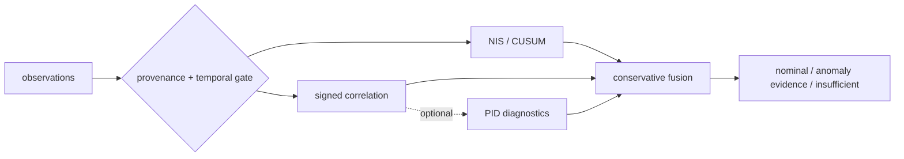

<p align="center">
  
</p>

<h1 align="center">galadriel</h1>

<p align="center"><strong>Galadriel's Mirror</strong> — an experimental cross-sensor consistency monitor for multi-sensor fusion.</p>

<p align="center">
  <a href="https://github.com/sepahead/galadriel/actions/workflows/ci.yml"></a>
  
  
  
  
</p>

Galadriel asks whether several sensors observing one track still agree. It combines
per-channel Normalized Innovation Squared (NIS) evidence with signed (sign-preserving)
cross-channel correlation over a producer-attested projection; optional PID diagnostics
explore nonlinear dependence. ("Signed" and "attested" here mean the sign of the
correlation and a producer provenance claim — not a cryptographic signature.)



## Run the verified demo

```bash
cargo run --locked --bin galadriel -- demo --frames 128 --seed 7
```

Representative output from that exact command (traces shortened here):

```text
═══ GALADRIEL'S MIRROR · cross-sensor consistency monitor ═══
┌─ CLEAN — corroborated airspace picture
│  visual    μ=2.93  ● consistent
└▷ VERDICT: NOMINAL
┌─ PHANTOM DOA — targeted single-channel spoof (acoustic)
│  acoustic  μ=66.68 ● ANOMALOUS
└▷ VERDICT: ATTRIBUTED-INCONSISTENCY (spoof-like evidence; cause unclassified) [acoustic]
┌─ BROADBAND JAM — correlated all-channel denial
└▷ VERDICT: BROAD-DEGRADATION (jam-like evidence; cause unclassified)
┌─ SYNTHETIC MOMENT-MATCHED SPOOF
│  baseline: NOMINAL — blind (NIS stays in-covariance)
└▷ correlation: ATTRIBUTED-INCONSISTENCY [acoustic]
```

The demo uses synthetic, common-frame observations. It demonstrates code paths, not
field performance.

## Evidence status

Run the versioned study with the single locked command in
[`docs/POST-AUDIT-EVIDENCE.md`](docs/POST-AUDIT-EVIDENCE.md). Publication runs refuse
a dirty worktree and write a checksummed manifest beside the machine-readable trials.
The clean-source reference artifact is
[`evidence/results/post-audit-v1-8a0084f`](evidence/results/post-audit-v1-8a0084f),
generated from commit `8a0084f` with `dirty=false`.

- The post-audit runner records its Git commit, toolchains, complete configuration,
  fixed seed domains, per-trial outcomes, holdout summaries, and checksums in one command.
- Synthetic stream studies report false-alert episodes/track-hour, mission false-alert
  probability, run length, conditional delay, abstention, attribution, autocorrelation,
  covariance-scale sensitivity, and provenance rejection separately.
- The bundled Crebain fixture proves bounded parsing and baseline replay only. It is
  roughly 15.8 seconds long and has no attested common projection, so recorded full-detector
  stream metrics are explicitly `not_estimable`, never replaced with synthetic numbers.
- There is no production Crebain common-projection publisher or receiver-verified mTLS
  deployment yet.

The artifact is a diagnostic result, not an acceptance result. In its independent clean
arm, the current default reports 26.26 alert episodes/hour and a 0.9167 mission probability
of at least one alert; the `phi=0.5` and `phi=0.85` autocorrelated arms report 102.95 and
262.57 episodes/hour. Ordinary acoustic missingness drives 99.35% fused monitoring
abstention. These results expose repeated-look and availability calibration work that must
be completed before any operational use.

> **Honest scope.** Galadriel detects statistical inconsistency, not truth. It cannot
> prove that an attributed channel is malicious, cannot detect an attacker that preserves
> cross-channel consistency, and must not silently veto a control path. Reports are
> advisory evidence, not calibrated posteriors.

> **Current integration status.** Normal Crebain captures omit the attested common
> projection; native radar residuals are polar while other residuals are Cartesian,
> sequential filter updates do not share one frozen prior, and association/gating
> suppresses rejected measurements. With those preconditions absent, correlation and
> fused assessment correctly remain `InsufficientEvidence`.

How Galadriel expects to be consumed by a downstream authorization gate — as
non-authoritative, record-only, never `ALLOW`-widening advisory evidence — is specified in
[`docs/ADVISORY-BOUNDARY.md`](docs/ADVISORY-BOUNDARY.md).

The research background and study design are documented in
[`docs/PAPER.md`](docs/PAPER.md), [`docs/JUSTIFICATION.md`](docs/JUSTIFICATION.md), and
[`docs/EVALUATION.md`](docs/EVALUATION.md).

## What the core requires

Galadriel consumes `PidObservation` records containing NIS and degrees of freedom.
Cross-sensor analysis additionally requires an optional `consistency_projection`:
a bounded signed vector plus non-zero physical-frame, projection-context, and frozen-prior
identifiers. Native `innovation` / `innovation_cov` fields remain diagnostic and are never
used as a cross-modal fallback. The detector requires:

- one track per assessment;
- strictly increasing, unique sequence numbers per track and modality;
- finite, valid observations with stable degrees of freedom;
- exact sequence alignment for cross-channel windows;
- matching projection dimension, frame ID, and context ID across modalities;
- one matching frozen-prior ID per sequence, never reused at another sequence;
- enough fresh observations from all configured modalities.

Invalid configuration or input returns `Err(...)`; it is not converted into a verdict.
Missing, stale, geometrically incomparable, or statistically insufficient evidence
returns `InsufficientEvidence`, not `Nominal`.

Crebain can emit JSONL when `CREBAIN_PID_JSONL` is set, but its normal runtime path only
enables the basic emitter. It does not emit the producer-attested common projection
needed for correlation/PID. Its successful-update-only stream is also downstream of
association and a chi-square gate, so missing or rejected measurements are censored
rather than represented. The current seam is suitable for contract and baseline smoke
testing, not for estimating production cross-modal dependence.

## Detector layers

### NIS/CUSUM magnitude layer

For each track and modality, a sliding NIS window is compared with its chi-square
reference and monitored for sustained shifts. Per-assessment channel tests control the
family-wise significance budget. A report is `Nominal` only when every configured
channel is fresh, ready, and consistent.

| Evidence | Verdict |
|---|---|
| all configured channels ready and consistent | `Nominal` |
| minority of channels anomalous while peers remain usable | `AttributedInconsistency { channels }` |
| most/all channels inflated together | `BroadDegradation` |
| positive but non-attributable or lower-direction evidence | `UnclassifiedAnomaly { channels }` |
| too little, stale, missing, or incompatible evidence | `InsufficientEvidence` |
| invalid input or configuration | `Err(...)` |

### Signed-correlation consistency layer

The default consistency layer uses signed Pearson correlation, family-wise
significance, and a unique strict-majority positive-consensus clique. Negative
correlation is not accepted as corroboration. A dyad, a tied clique, or a collection
with no coherent positive consensus cannot support outlier attribution.

Every producer-declared projection axis is assessed. The significance budget is
Bonferroni-split across axes and channel pairs. Different positive channel attributions
across axes, or a positive axis beside an insufficient axis, become
`UnclassifiedAnomaly` rather than `AttributedInconsistency`.

`galadriel_core::assess_default` fuses magnitude and consistency evidence without
turning an unavailable consistency assessment into `Nominal`.

### PID research layer

The optional `pid` feature adds geometry-gated KSG mutual information and
shared-exclusions PID atoms. MI/PID is sign-invariant and therefore **additive**: it
cannot repair missing geometry, create a consensus from a dyad, or override
contradictory signed correlation. Canonical synthetic studies show regimes where this
evidence may be useful; they do not show that those regimes occur in crebain output.
The path pins pid-rs 1.0, declares its restricted regular-continuous support model,
records seeded Gaussian observation noise as an estimand-changing model choice, and
classifies PID2 atoms as `experimental_restricted_domain`. Point gates use pid-rs's
report-first KSG API; bounded circular-resample confirmation remains an explicitly
experimental raw-scalar pipeline. See the [0.4→1.0 migration record](docs/PID_RS_1_0_MIGRATION.md).

## Project status

**Version `0.1.0`, pre-1.0, research prototype.** The API is not frozen. The
`research-snapshot-v0.1.0` tag is explicitly non-production, and every workspace package
currently sets `publish = false`. Unit, property, integration, and synthetic-study tests
exercise the implementation, but no current evidence supports calling it field-validated
or production-ready.

| Crate | Role | Evidence level |
|---|---|---|
| [`galadriel-core`](crates/galadriel-core) | NIS/CUSUM, signed correlation, fused assessment | Tested research core |
| [`galadriel-sim`](crates/galadriel-sim) | synthetic scenarios and injections | Synthetic only |
| [`galadriel-cli`](crates/galadriel-cli) | `demo` / `replay` driver | Operator prototype |
| [`galadriel-pid`](crates/galadriel-pid) | KSG-MI / PID evidence | Optional research path |
| [`galadriel-ncp`](crates/galadriel-ncp) | bounded JSONL ingest; versioned named-sensor envelope; optional Zenoh subscriber | Payload/ingest + in-process Zenoh loopback e2e tested; no live Crebain publisher or deployment evidence |
| [`galadriel-eval`](crates/galadriel-eval) | Monte Carlo evaluation and cost bench | Synthetic only |
| [`galadriel-justify`](crates/galadriel-justify) | canonical forced-vs-justified studies | Synthetic/theoretical only |

The workspace MSRV is **Rust 1.89**. Mutable test totals and benchmark values are not
treated as project-status claims.

## Features and dependencies

| Feature | Pulls | Adds |
|---|---|---|
| default | no sibling integration crates | core, simulator, CLI |
| `pid` | `pid-core` 1.0 experimental continuous/pipeline surface | KSG-MI/PID research layer |
| `ncp` | `ncp-core` | bounded JSONL ingest; NCP 0.8 key helpers and versioned sidecar envelope; the CLI `replay` subcommand |
| `ncp-live` | `ncp-zenoh`, `tokio` | read-only named-perception subscriber with explicit secure/development mode and bounded sequence state |

The public `pid-rs` repository and NCP's `ncp-core`/`ncp-zenoh` crates are pinned by
exact Git revisions. The pid-rs revision declares 1.0.0 (there is currently no v1 tag),
while the NCP revision corresponds to public tag `v0.8.0`.
A fresh clone requires no sibling checkout, private repository token, or global Git
credential rewrite.

The live subscriber uses NCP's named perception route,
`{realm}/session/{id}/sensor/galadriel-pid`, built through
`Keys::try_sensor_named(id, "galadriel-pid")`. NCP's hardened ACL already covers that route
with its least-privilege sensor-plane rules: an authenticated plant/producer may publish
and an authenticated observer may subscribe. Galadriel does not yet have a production
Crebain publisher or an end-to-end mTLS deployment test, so compilation is still not live
integration evidence.

Every live payload is a strict `galadriel_pid_observation` schema `1.0` envelope carrying
`ncp_version`, advisory `contract_hash`, `session_id`, `producer_id`, and the existing
Crebain-compatible `observation`; the exact independent-producer contract is
[`galadriel-pid-envelope-v1.schema.json`](crates/galadriel-ncp/schemas/galadriel-pid-envelope-v1.schema.json)
(a descriptive snapshot — the runtime `SidecarEnvelope` validation gate is normative).
The tap rejects incompatible versions, undeclared fields, malformed
metadata, cross-session/cross-producer payloads, unsafe JSON integers, invalid observations,
and replay/sequence violations. Contract-hash drift is accepted per NCP policy but counted
for operators. Callers must choose `TransportMode::Secure` (strict mTLS client config) or
explicitly acknowledge `TransportMode::QuietDevelopment`; there is no implicit security
default. Applications should prefer `SidecarTap::subscribe_channel(HandoffConfig)`: it performs
one nonblocking bounded enqueue on the receive task, drops the newest accepted observation at
capacity without reopening replay eligibility, invalidates queued generations on explicit
reset, and exposes queue depth, oldest sequence, drop reasons, enqueue latency, and consumer
lag. Callback-duration metrics expose slow inline work and the bounded adapter's internal
enqueue cost. The inline `subscribe_with_health` callback remains available for advanced
low-cost work.
`LiveLimits::max_payload_bytes` bounds decoding after NCP callback delivery, but the
pinned `ncp-zenoh` callback currently materializes an owned payload first; deployments still
need a transport/broker message-size ceiling to bound receive-memory pressure. Subscriber
silence can still mean no traffic, a realm/key mismatch, ACL denial, or producer failure.
Producers must use a fresh session ID for every process epoch, and all-modal silence still
requires a heartbeat.

This is a project-owned sidecar payload, not a normative NCP `SensorFrame`. A future
Crebain producer therefore builds the key with
`bus.keys().try_sensor_named(session_id, "galadriel-pid")` and publishes the serialized
envelope through `ZenohBus::put(..., Plane::Perception)`. It must not call
`put_sensor_named`, whose publisher gate correctly accepts only a complete NCP
`sensor_frame`.

## Building and testing

```bash
cargo fmt --all --check
cargo clippy --workspace --all-targets --all-features --locked -- -D warnings
cargo test --workspace --all-features --locked
RUSTDOCFLAGS="-D warnings" cargo doc --workspace --all-features --no-deps --locked
cargo build -p galadriel-core --no-default-features --locked
cargo deny --all-features --locked check
```

The workspace MSRV is **1.89**. Crate targets forbid unsafe code.

## Honest limitations

- **Consistency-preserving attacks remain invisible.** The
  [frustum attack](https://www.usenix.org/conference/usenixsecurity22/presentation/hallyburton)
  is a concrete example of an attack that preserves camera/LiDAR consistency.
- **Consistency is not truth.** A decoupled channel can represent a spoof, a true
  channel-specific event, a coordinate mismatch, or an estimator artifact.
- **Current crebain output has no consistency projection.** Radar's native innovation is
  polar while visual/acoustic innovations are Cartesian; sequential updates use
  different priors. Galadriel therefore ignores those native vectors for consistency.
- **Gating censors evidence.** Association and chi-square rejection can turn the largest
  attacks into missing observations. Missingness is informative, not random.
- **No input means no detector call.** Per-channel silence can be noticed when another
  channel advances assessment time. All-modal silence requires an external producer or
  transport heartbeat.
- **Advisory attribution is not enforcement.** Authentication, ACLs, mTLS, a safety
  governor, and an independently reviewed control policy remain separate requirements.

## Producer and integration roadmap

The next milestone is an honest producer contract and recorded evaluation, not a
release label:

1. Emit `consistency_projection` for all modalities from a **common frozen prior**, in
   one documented **common coordinate frame**, with stable frame/context IDs and a
   unique shared prior ID per sequence.
2. Emit association/gate misses and rejected updates so selection bias and liveness are
   observable.
3. Add producer **heartbeats** and use a fresh NCP **session identifier** for every
   process epoch. The live schema and restart identity are now explicit; the producer
   implementation is still absent.
4. Provide a supported normal-runtime option for the common projection (and optional
   native innovation/covariance diagnostics); `CREBAIN_PID_JSONL` alone does not.
5. Evaluate recorded, pre-gate data and report producer selection effects separately
   from detector errors.
6. Add the Crebain NCP named-sensor publisher under the existing least-privilege
   sensor-plane ACL, then test traffic, denial, restart, decode-failure, and
   all-modal-silence behavior end to end over mTLS.
7. Keep packages `publish = false` until the producer contract, recorded evidence, and
   API stability receive an explicit release review.

## Documentation

- [`docs/MOTIVATION.md`](docs/MOTIVATION.md) — threat grounding and scope.
- [`docs/PAPER.md`](docs/PAPER.md) — research argument and current evidence boundary.
- [`docs/JUSTIFICATION.md`](docs/JUSTIFICATION.md) — when MI/PID can add information.
- [`docs/EVALUATION.md`](docs/EVALUATION.md) — reproducible synthetic methodology.
- [`docs/POST-AUDIT-EVIDENCE.md`](docs/POST-AUDIT-EVIDENCE.md) — one-command,
  checksummed streaming evidence artifact.
- [`docs/RELATED-WORK.md`](docs/RELATED-WORK.md) — competing and complementary methods.

## License

Licensed under either [MIT](LICENSE-MIT) or [Apache-2.0](LICENSE-APACHE) at your
option. Part of the [`sepahead`](https://github.com/sepahead) ecosystem.
