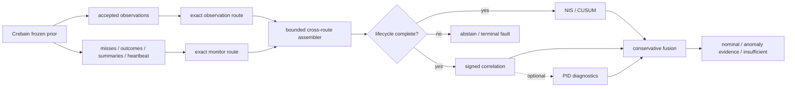

<p align="center">
  
</p>

<h1 align="center">galadriel</h1>

<p align="center"><strong>Galadriel's Mirror</strong> — an experimental cross-sensor consistency monitor for multi-sensor fusion.</p>

<p align="center">
  <a href="https://github.com/sepahead/galadriel/actions/workflows/ci.yml"></a>
  
  
  
  
</p>

Galadriel asks whether several sensors observing one track still agree. It combines
per-channel Normalized Innovation Squared (NIS) evidence with signed (sign-preserving)
cross-channel correlation over a producer-attested projection; optional PID diagnostics
explore nonlinear dependence. ("Signed" and "attested" here mean the sign of the
correlation and a producer provenance claim — not a cryptographic signature.)



## Run the verified demo

```bash
cargo run --locked --bin galadriel -- demo --frames 128 --seed 7
```

Representative output from that exact command (traces shortened here):

```text
═══ GALADRIEL'S MIRROR · cross-sensor consistency monitor ═══
┌─ CLEAN — corroborated airspace picture
│  visual    μ=2.93  ● consistent
└▷ VERDICT: NOMINAL
┌─ PHANTOM DOA — targeted single-channel spoof (acoustic)
│  acoustic  μ=66.68 ● ANOMALOUS
└▷ VERDICT: ATTRIBUTED-INCONSISTENCY (spoof-like evidence; cause unclassified) [acoustic]
┌─ BROADBAND JAM — correlated all-channel denial
└▷ VERDICT: BROAD-DEGRADATION (jam-like evidence; cause unclassified)
┌─ SYNTHETIC MOMENT-MATCHED SPOOF
│  baseline: NOMINAL — blind (NIS stays in-covariance)
└▷ correlation: ATTRIBUTED-INCONSISTENCY [acoustic]
```

The demo uses synthetic, common-frame observations. It demonstrates code paths, not
field performance.

## Evidence status

Run the versioned study with the single locked command in
[`docs/POST-AUDIT-EVIDENCE.md`](docs/POST-AUDIT-EVIDENCE.md). Publication runs refuse
a dirty worktree and write a checksummed manifest beside the machine-readable trials.
The clean-source reference artifact is
[`evidence/results/post-audit-v1-8a0084f`](evidence/results/post-audit-v1-8a0084f),
generated from commit `8a0084f` with `dirty=false`.

- The post-audit runner records its Git commit, toolchains, complete configuration,
  fixed seed domains, per-trial outcomes, holdout summaries, and checksums in one command.
- Synthetic stream studies report false-alert episodes/track-hour, mission false-alert
  probability, run length, conditional delay, abstention, attribution, autocorrelation,
  covariance-scale sensitivity, and provenance rejection separately.
- The bundled Crebain fixture proves bounded parsing and baseline replay only. It is
  roughly 15.8 seconds long and has no attested common projection, so recorded full-detector
  stream metrics are explicitly `not_estimable`, never replaced with synthetic numbers.
- Crebain now has a normal-runtime, opt-in producer baseline for the common projection and
  lifecycle route, and Galadriel has a bounded operational receiver. Cross-repository
  component closeout is complete: Crebain `4c311900ade5668200a48d56fb191be1916b884a`
  requires the deployment epoch, contains the byte-identical shared registry fixture, and
  pins Galadriel `81437d807ca83b66b45c8353968948e540072d97`. In-process tests are component
  evidence, not a receiver-verified external mTLS/ACL deployment or field study.

The artifact is a diagnostic result, not an acceptance result. In its independent clean
arm, the current default reports 26.26 alert episodes/hour and a 0.9167 mission probability
of at least one alert; the `phi=0.5` and `phi=0.85` autocorrelated arms report 102.95 and
262.57 episodes/hour. Ordinary acoustic missingness drives 99.35% fused monitoring
abstention. These results expose repeated-look and availability calibration work that must
be completed before any operational use.

> **Honest scope.** Galadriel detects statistical inconsistency, not truth. It cannot
> prove that an attributed channel is malicious, cannot detect an attacker that preserves
> cross-channel consistency, and must not silently veto a control path. Reports are
> advisory evidence, not calibrated posteriors.

> **Current integration status.** The opt-in Crebain producer baseline snapshots one immutable
> pre-association prior, maps supported measurements into the pinned Cartesian context,
> emits explicit lifecycle outcomes/misses and heartbeats, and publishes both strict
> routes through bounded lanes. Crebain `4c311900ade5668200a48d56fb191be1916b884a`
> requires an operator-provisioned epoch, contains the byte-identical shared
> registry golden, and pins Galadriel `81437d807ca83b66b45c8353968948e540072d97`.
> Deployment remains responsible for epoch freshness and non-reuse. This closes the
> epoch/golden/revision-pin task. Historical captures remain `not_estimable`; no
> real-router certificate/ACL campaign or recorded stream calibration has been accepted.

How Galadriel expects to be consumed by a downstream authorization gate — as
non-authoritative, record-only, never `ALLOW`-widening advisory evidence — is specified in
[`docs/ADVISORY-BOUNDARY.md`](docs/ADVISORY-BOUNDARY.md).

The research background and study design are documented in
[`docs/PAPER.md`](docs/PAPER.md), [`docs/JUSTIFICATION.md`](docs/JUSTIFICATION.md), and
[`docs/EVALUATION.md`](docs/EVALUATION.md).

## What the core requires

Galadriel consumes `PidObservation` records containing NIS and degrees of freedom.
Cross-sensor analysis additionally requires an optional `consistency_projection`:
a bounded signed vector plus non-zero physical-frame, projection-context, and frozen-prior
identifiers. Native `innovation` / `innovation_cov` fields remain diagnostic and are never
used as a cross-modal fallback. The detector requires:

- one track per assessment;
- strictly increasing, unique sequence numbers per track and modality;
- finite, valid observations with stable degrees of freedom;
- exact sequence alignment for cross-channel windows;
- matching projection dimension, frame ID, and context ID across modalities;
- one matching frozen-prior ID per sequence, never reused at another sequence;
- enough fresh observations from all configured modalities.

Invalid configuration or input returns `Err(...)`; it is not converted into a verdict.
Missing, stale, geometrically incomparable, lifecycle-incomplete, or statistically
insufficient evidence returns `InsufficientEvidence`/an explicit abstention, not `Nominal`.
The legacy `CREBAIN_PID_JSONL` capture remains a baseline-only path. Operational evidence
uses Crebain's separately gated two-route producer and Galadriel's assembler; it never
infers a successful lifecycle stage from a missing record.

## Detector layers

### NIS/CUSUM magnitude layer

For each track and modality, a sliding NIS window is compared with its chi-square
reference and monitored for sustained shifts. Per-assessment channel tests control the
family-wise significance budget. A report is `Nominal` only when every configured
channel is fresh, ready, and consistent.

| Evidence | Verdict |
|---|---|
| all configured channels ready and consistent | `Nominal` |
| minority of channels anomalous while peers remain usable | `AttributedInconsistency { channels }` |
| most/all channels inflated together | `BroadDegradation` |
| positive but non-attributable or lower-direction evidence | `UnclassifiedAnomaly { channels }` |
| too little, stale, missing, or incompatible evidence | `InsufficientEvidence` |
| invalid input or configuration | `Err(...)` |

### Signed-correlation consistency layer

The default consistency layer uses signed Pearson correlation, family-wise
significance, and a unique strict-majority positive-consensus clique. Negative
correlation is not accepted as corroboration. A dyad, a tied clique, or a collection
with no coherent positive consensus cannot support outlier attribution.

Every producer-declared projection axis is assessed. The significance budget is
Bonferroni-split across axes and channel pairs. Different positive channel attributions
across axes, or a positive axis beside an insufficient axis, become
`UnclassifiedAnomaly` rather than `AttributedInconsistency`.

`galadriel_core::assess_default` fuses magnitude and consistency evidence without
turning an unavailable consistency assessment into `Nominal`.

### PID research layer

The optional `pid` feature adds geometry-gated KSG mutual information and
shared-exclusions PID atoms. MI/PID is sign-invariant and therefore **additive**: it
cannot repair missing geometry, create a consensus from a dyad, or override
contradictory signed correlation. Canonical synthetic studies show regimes where this
evidence may be useful; they do not show that those regimes occur in crebain output.
The path pins pid-rs 1.0, declares its restricted regular-continuous support model,
records seeded Gaussian observation noise as an estimand-changing model choice, and
classifies PID2 atoms as `experimental_restricted_domain`. Point gates use pid-rs's
report-first KSG API; bounded circular-resample confirmation remains an explicitly
experimental raw-scalar pipeline. See the [0.4→1.0 migration record](docs/PID_RS_1_0_MIGRATION.md).

## Project status

**Version `0.1.0`, pre-1.0, research prototype.** The API is not frozen. The
`research-snapshot-v0.1.0` tag is explicitly non-production, and every workspace package
currently sets `publish = false`. Unit, property, integration, and synthetic-study tests
exercise the implementation, but no current evidence supports calling it field-validated
or production-ready.

| Crate | Role | Evidence level |
|---|---|---|
| [`galadriel-core`](crates/galadriel-core) | NIS/CUSUM, signed correlation, fused assessment | Tested research core |
| [`galadriel-sim`](crates/galadriel-sim) | synthetic scenarios and injections | Synthetic only |
| [`galadriel-cli`](crates/galadriel-cli) | `demo`, `replay`, and secure `observe` driver | Operator prototype; live path component-tested |
| [`galadriel-pid`](crates/galadriel-pid) | KSG-MI / PID evidence | Optional research path |
| [`galadriel-ncp`](crates/galadriel-ncp) | strict codecs, pinned registry, monitor tap, assembler, lifecycle gate, operational Zenoh receiver | Unit/golden/in-process Zenoh tested; no external deployment evidence |
| [`galadriel-eval`](crates/galadriel-eval) | Monte Carlo evaluation and cost bench | Synthetic only |
| [`galadriel-justify`](crates/galadriel-justify) | canonical forced-vs-justified studies | Synthetic/theoretical only |

The workspace MSRV is **Rust 1.89**. Mutable test totals and benchmark values are not
treated as project-status claims.

## Features and dependencies

| Feature | Pulls | Adds |
|---|---|---|
| default | no sibling integration crates | core, simulator, CLI |
| `pid` | `pid-core` 1.0 experimental continuous/pipeline surface | KSG-MI/PID research layer |
| `ncp` | `ncp-core` | bounded JSONL ingest; NCP 0.8 key helpers; strict observation and producer-monitor envelopes; the CLI `replay` subcommand |
| `ncp-live` | `ncp-zenoh`, exact `zenoh` 1.9 guard types, `tokio` | secure `observe` command plus bounded two-route receiver, deadlines, lifecycle gate, and health state |

The public `pid-rs` repository and NCP's `ncp-core`/`ncp-zenoh` crates are pinned by
exact Git revisions. The pid-rs revision declares 1.0.0 (there is currently no v1 tag),
while the NCP revision corresponds to public tag `v0.8.0`.
A fresh clone requires no sibling checkout, private repository token, or global Git
credential rewrite.

Run the operational observer only with the rendered observer config and the same exact
epoch/registry pin supplied to Crebain:

```bash
export NCP_ZENOH_CONFIG=/secure/config/galadriel-epoch/zenoh-observer.json5
cargo run --locked --features ncp-live --bin galadriel -- observe \
  --realm engram/ncp \
  --epoch "$CREBAIN_GALADRIEL_EPOCH" \
  --producer-id crebain-galadriel-producer \
  --registry /secure/config/crebain-registry.json \
  --registry-sha256 "$CREBAIN_GALADRIEL_REGISTRY_DIGEST"
```

The renderer's checksummed `galadriel-handoff.json` binds that realm/epoch/producer/
registry tuple to the two authorized certificate CNs. Verify the complete digest manifest
and use the handoff as the deployment record before starting either process.

The command reports lifecycle abstentions as evidence insufficiency, labels every evaluated
result `calibrated_posterior=false`, exposes terminal health on exit, and stops on the first
ingress/assembly/liveness fault. Configuration generation and external authorization drills
are in [`docs/SECURE-DEPLOYMENT.md`](docs/SECURE-DEPLOYMENT.md).

The operational receiver subscribes one shared Zenoh session to the two exact keys
`{realm}/session/{epoch}/sensor/galadriel-{pid,monitor}`. Both callbacks serialize through
one bounded nonblocking ingress; the assembler enforces route provenance, contiguous
monitor sequencing, observation replay limits, registry/context/prior identity, producer
accounting, frame/reorder deadlines, and heartbeat silence. Its first terminal fault
invalidates queued events, so no later `FrameReady` crosses the boundary.
The fixed defaults allow 30 seconds for the first heartbeat after transport activation,
then require the declared one-second cadence within a three-second receipt deadline.
Replay high-water state never evicts within an epoch: operators must watch the CLI's
prior-identity and observation-stream utilization and coordinate a new epoch before a cap.
Live library callers must use a Tokio runtime with its time driver enabled.

Every live payload is a strict `galadriel_pid_observation` schema `1.0` envelope carrying
`ncp_version`, advisory `contract_hash`, `session_id`, `producer_id`, and the existing
Crebain-compatible `observation`; the exact independent-producer contract is
[`galadriel-pid-envelope-v1.schema.json`](crates/galadriel-ncp/schemas/galadriel-pid-envelope-v1.schema.json)
(a descriptive snapshot — the runtime `SidecarEnvelope` validation gate is normative).
The observation tap and assembler reject incompatible versions, undeclared fields, malformed
metadata, cross-session/cross-producer payloads, unsafe JSON integers, invalid observations,
and replay/sequence violations. Contract-hash drift is advisory and counted. The standalone
observation tap still exposes explicit secure/development modes and bounded handoff APIs;
the `observe` command instead always calls the strict secure constructor and requires an
externally pinned registry digest.
`LiveLimits::max_payload_bytes` bounds decoding after NCP callback delivery, but the
pinned `ncp-zenoh` callback currently materializes an owned payload first; deployments still
need a transport/broker message-size ceiling to bound receive-memory pressure. Subscriber
silence can still mean no traffic, a realm/key mismatch, ACL denial, or producer failure.
Producers must use a fresh, deployment-supplied session ID for every process epoch. Monitor
heartbeats make all-modal silence visible after the finite initial grace or configured
steady monotonic deadline.

Producer lifecycle and liveness use a separate strict
`galadriel_producer_event` schema `1.0` on
`{realm}/session/{id}/sensor/galadriel-monitor`. Its bounded codec and adjacent-tagged
heartbeat, outcome, miss, and frame-summary types are frozen in
[`galadriel-monitor-envelope-v1.schema.json`](crates/galadriel-ncp/schemas/galadriel-monitor-envelope-v1.schema.json).
The monitor tap, pinned registry, fail-closed assembler, lifecycle adapter, and operational
receiver implement the consumer boundary described in
[`docs/PRODUCER-CONTRACT.md`](docs/PRODUCER-CONTRACT.md). Crebain contains the matching
opt-in publisher baseline. Crebain `4c311900ade5668200a48d56fb191be1916b884a`
requires the deployment epoch, contains the shared registry golden, and pins the Galadriel
implementation at `81437d807ca83b66b45c8353968948e540072d97`. None of this attests a
remote router's active ACL or calibrates the detector.

These are project-owned sidecar payloads, not normative NCP `SensorFrame`s. The
Crebain producer builds the two exact named-sensor keys and publishes the
serialized envelopes through `ZenohBus::put(..., Plane::Perception)`. It must not call
`put_sensor_named`, whose publisher gate correctly accepts only a complete NCP
`sensor_frame`.

## Building and testing

```bash
cargo fmt --all --check
cargo clippy --workspace --all-targets --all-features --locked -- -D warnings
cargo test --workspace --all-features --locked
RUSTDOCFLAGS="-D warnings" cargo doc --workspace --all-features --no-deps --locked
cargo build -p galadriel-core --no-default-features --locked
cargo deny --all-features --locked check
```

The workspace MSRV is **1.89**. Crate targets forbid unsafe code.

## Honest limitations

- **Consistency-preserving attacks remain invisible.** The
  [frustum attack](https://www.usenix.org/conference/usenixsecurity22/presentation/hallyburton)
  is a concrete example of an attack that preserves camera/LiDAR consistency.
- **Consistency is not truth.** A decoupled channel can represent a spoof, a true
  channel-specific event, a coordinate mismatch, or an estimator artifact.
- **Historical Crebain captures have no consistency projection.** The opt-in producer now
  computes a registered Cartesian projection from one frozen prior; older JSONL fixtures
  remain baseline-only and Galadriel never falls back to their native mixed-frame vectors.
- **Gating censors evidence.** Association and chi-square rejection can turn the largest
  attacks into missing observations. Missingness is informative, not random.
- **Lifecycle absence is not health.** Explicit misses/rejections immediately break the
  affected statistical suffix. All-modal silence becomes a heartbeat fault in the
  operational receiver, but transport authentication still cannot prove physical truth.
- **Advisory attribution is not enforcement.** Authentication, ACLs, mTLS, a safety
  governor, and an independently reviewed control policy remain separate requirements.

## Producer and integration roadmap

The Galadriel implementation and reciprocal producer closeout are complete at component
level. Crebain `4c311900ade5668200a48d56fb191be1916b884a` immutably pins the Galadriel
implementation at `81437d807ca83b66b45c8353968948e540072d97`:

- [x] frozen-prior Cartesian producer projection and explicit gate/lifecycle evidence;
- [x] refresh the Crebain publisher to require the exact deployment-supplied epoch and pin
  the merged Galadriel implementation;
- [x] commit and verify the byte/hash-identical registry golden in Crebain;
- [x] bounded live monitor, cross-route assembler, lifecycle abstention boundary, secure
  observer CLI, and exact-epoch least-privilege configuration generator;
- [x] CI, current-stable, fuzz, mutation, supply-chain, and reproducible synthetic evidence
  paths;
- [ ] real multi-process mTLS/ACL allow-and-deny campaign with retained router/certificate
  evidence;
- [ ] recorded pre-gate stream study and independent stream-level threshold calibration;
- [ ] explicit API/release review before removing `publish = false` or the research label.

The unchecked items are evidence gates, not missing code silently treated as success. See
the [secure deployment runbook](docs/SECURE-DEPLOYMENT.md) for the exact external drills.

## Documentation

- [`docs/MOTIVATION.md`](docs/MOTIVATION.md) — threat grounding and scope.
- [`docs/PAPER.md`](docs/PAPER.md) — research argument and current evidence boundary.
- [`docs/JUSTIFICATION.md`](docs/JUSTIFICATION.md) — when MI/PID can add information.
- [`docs/EVALUATION.md`](docs/EVALUATION.md) — reproducible synthetic methodology.
- [`docs/PRODUCER-CONTRACT.md`](docs/PRODUCER-CONTRACT.md) — frozen observation and
  lifecycle/liveness wire contract plus operational acceptance boundary.
- [`docs/SECURE-DEPLOYMENT.md`](docs/SECURE-DEPLOYMENT.md) — exact-epoch mTLS/ACL profile,
  runnable observer, health sequence, and external acceptance drills.
- [`docs/POST-AUDIT-EVIDENCE.md`](docs/POST-AUDIT-EVIDENCE.md) — one-command,
  checksummed streaming evidence artifact.
- [`docs/RELATED-WORK.md`](docs/RELATED-WORK.md) — competing and complementary methods.

## License

Licensed under either [MIT](LICENSE-MIT) or [Apache-2.0](LICENSE-APACHE) at your
option. Part of the [`sepahead`](https://github.com/sepahead) ecosystem.
