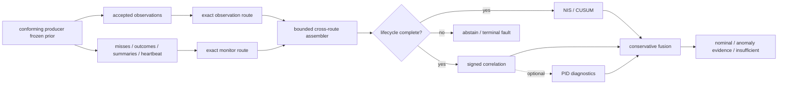

<p align="center">
  
</p>

# galadriel

<p align="center"><strong>Galadriel's Mirror</strong> — an experimental cross-sensor consistency monitor for multi-sensor fusion.</p>

<p align="center">
  <a href="https://github.com/sepahead/galadriel/actions/workflows/ci.yml"></a>
  
  
  
  
  
</p>

## Abbreviations

| Short form | Meaning |
|---|---|
| ACL | access control list |
| API | application programming interface |
| CA | certificate authority |
| CLI | command-line interface |
| CN | certificate common name |
| CUSUM | cumulative sum |
| DOA | direction of arrival |
| DOI | digital object identifier |
| JSON | JavaScript Object Notation |
| JSONL | JavaScript Object Notation Lines |
| KSG | Kraskov-Stögbauer-Grassberger |
| LiDAR | light detection and ranging |
| MI | mutual information |
| mTLS | mutual Transport Layer Security |
| MSRV | minimum supported Rust version |
| NCP | Neuro-Cybernetic Protocol |
| NIS | normalized innovation squared |
| PID | partial information decomposition |
| PID2 | two-source partial information decomposition |
| PID3 | three-source partial information decomposition |
| ROS / ROS 2 | Robot Operating System / Robot Operating System 2 |
| SPKI | Subject Public Key Info |
| SSH | Secure Shell |
| TLS | Transport Layer Security |
| WebPKI | Web Public Key Infrastructure |

Galadriel checks whether several sensors that observe one track still agree.
It combines per-channel Normalized Innovation Squared (NIS) evidence with signed cross-channel correlation.
The correlation keeps its sign and uses a producer-attested projection.
Optional PID diagnostics explore nonlinear dependence.

Here, "signed" identifies the correlation sign.
"Attested" identifies a producer provenance claim. Neither term identifies a cryptographic signature.



## Ecosystem boundaries

Galadriel has one local evidence path and no command-authority path.
A dependency pin alone does not prove an authorized or current cross-repository integration.
A shared transport or historical fixture also does not prove such an integration.

| Project | Direction | Required or optional | Why connected | Explicit 0.9.0 boundary |
| --- | --- | --- | --- | --- |
| [pid-rs](https://github.com/sepahead/pid-rs) | Upstream algorithm library | The default CLI build does not use it. The PID, justification, and evaluation crates require its exact `pid-core` pin. The CLI `pid` feature also requires the pin. It is linked code, not a runtime service. | It supplies restricted-domain KSG mutual-information and PID primitives for additive research diagnostics. | Pin `1cd2424f7967e1752dcc8e53859e8fdad3566f51` declares 1.0.0. It transitively resolves `pid-runlog` 1.0.0 from the same revision. Galadriel claims no public v1 tag or published upstream 1.x artifact. |
| [NCP](https://github.com/sepahead/NCP) | Upstream wire and transport libraries | The default CLI build does not use it. `galadriel-ncp`, evaluation, and CLI `ncp` require `ncp-core`. `ncp-live` also pulls `ncp-zenoh`, Zenoh, and Tokio. | It supplies wire-0.8 key, version, and contract helpers. It also supplies the optional Zenoh bus. Galadriel owns its sidecar envelopes, bounded offline JSONL, and operational receiver. | Both NCP crates pin `2f5bd586d4bb20c90362bb6f5698b7f64057ba4e`. This pin does not prove remote authorization, ACL enforcement, or wire-1.0 compatibility. |
| [Crebain](https://github.com/sepahead/crebain) | External upstream producer relationship | There is no Cargo dependency. The demo, simulation, evaluation, and replay do not require Crebain. Live operation needs an authorized contract-conforming producer. The code identity does not have to be Crebain. | It supplies the inspected reference component for the observation and monitor sidecar contract. It also supplies the byte-identical retained registry fixture. | Crebain's formal 0.9 boundary freezes an earlier Galadriel audit head. Galadriel claims no reciprocal final-candidate or deployment qualification. |
| [Haldir](https://github.com/sepahead/haldir) | Prospective downstream authorization consumer | Version 0.9.0 has no dependency, adapter, route, or runtime edge. | It defines the intended future record-only boundary. It also defines the independently admitted restrict-only boundary. Tests ensure that Galadriel evidence cannot grant or widen authority. | The integration phase has not started. There is no runtime evidence. |
| [Prisoma](https://github.com/sepahead/prisoma) | Prospective downstream offline comparator and covariate consumer | Version 0.9.0 has no dependency, adapter, route, or runtime edge. | It documents a possible future immutable offline covariate import. It keeps Galadriel sidecars outside normative NCP `SensorFrame`s. | The relationship is E0. Shared NCP and PID dependencies do not imply schema compatibility or independent-implementation replication. |
| Engram / Paper2Brain | External application and realm context | There is no dependency, API, process, route, adapter, or runtime edge. The literal `engram/ncp` is a configurable example realm. It is not an application integration. | It makes the example deployment namespace concrete. NCP remains the actual library, key, and transport interface. | Paper2Brain is private and unpublished application inventory only. Galadriel claims no public artifact, compatibility, or deployment qualification. |
| ROS / ROS 2 | External robotics middleware | Version 0.9.0 has no dependency, message binding, topic, service, action, bridge, node, or runtime edge. | It identifies an ecosystem boundary that a future adapter must define and qualify explicitly. | Galadriel claims no ROS compatibility, bag import, or live bridge. |
| External authority or controller | Prospective downstream policy and control boundary | There is no command, control, lease, watchdog, credential, or authority path. | A future consumer can record advisory evidence. It can apply only an independently admitted restrict-only policy. | Galadriel cannot grant, widen, refresh, or restore authority. `Nominal` is never permission. |

Galadriel is the sole center of this relationship view and has no self-edge.
The declared directed graph includes `pid-rs → Galadriel` and `NCP → Galadriel`.
It also includes optional conforming producer `→ Galadriel`.
The prospective edges are `Galadriel → Haldir/Prisoma`.

The Engram/Paper2Brain, ROS, and external-authority entries are explicit non-edges.
No edge points back to an upstream producer or library.
Thus, the 0.9.0 graph is acyclic and contains no command loop.

The read-only coordination inspection on 2026-07-18 recorded exact repository heads.
It recorded NCP `10492c81ac671ef1909962a9f1fede33781b9933`.
It recorded Crebain `0a58a5b8dd799884ddb06f1308b1748216fab322`.
It recorded Haldir remote `main` at `0e94f61cfd5c78482198a765157571746a256181`.
It recorded Prisoma `63cff105e0e40281376e6f827d7782e9b351961a`.

A second read-only Haldir inspection on 2026-07-18 observed another remote `main` head.
That head was `dd3d8a1c993721f89a1edb04dec5247761c694ad`.
Git ancestry shows that this object descends from the discovery object.
The path includes Haldir current-head qualification and repository-inventory work.
The second observation supersedes only the mutable Haldir discovery-head reference.
It does not rewrite either observation, frozen or historical evidence, or a Galadriel release input.

A reinspection on 2026-07-22 found Haldir remote `main` at `c0e4b3d156500684329a92bcb16e0609894fd738`.
This object descends from both earlier observations.
Its CH-T001 changes between the observed heads activate repository-inventory and release evidence only.
Haldir's retained downstream disposition records no runtime-surface or external-conformance change.
This latest object remains mutable provenance.
It is not a Galadriel pin, adapter, route, or reciprocal acceptance.

These mutable repository heads are inspection provenance, not reciprocal compatibility pins.
NCP's wire-1.0 topology remains proposed.
It is incompatible with the current named wire-0.8 sidecars.
Crebain retains component-level schema-v1 alignment.
But it freezes Galadriel `94e2f8cc01f352d2bf899b7f656997f143a2588f` only as an audit input.

None of the three inspected Haldir objects contains a Galadriel adapter or runtime edge.
Prisoma has no direct sidecar path.
The `engram/ncp` realm string creates no Paper2Brain edge.
The source tree contains no ROS or external-authority adapter.
Current reciprocal integration and final cross-repository qualification remain `NOT_CLAIMED`.

The canonical [machine-readable inspection cut](release/0.9.0/ecosystem-cut.json) binds the same objects.
It also binds local absence declarations, relationship classes, optionality, rationale, and the acyclic boundary.
It binds the ordered Haldir supersession so subsequent prose edits cannot silently change this history.

[`docs/PRODUCER-CONTRACT.md`](docs/PRODUCER-CONTRACT.md) defines the exact route and lifecycle rules.
[`docs/ADVISORY-BOUNDARY.md`](docs/ADVISORY-BOUNDARY.md) defines the downstream-effect rules.
[`docs/ECOSYSTEM-CONNECTIONS.md`](docs/ECOSYSTEM-CONNECTIONS.md) records the dated evidence and claim-by-claim interpretation.
Current external repository heads can move independently.
Version 0.9.0 claims only the dependency revisions and local evidence named here.

## Run the verified demo

```bash
cargo run --locked --bin galadriel -- demo --frames 128 --seed 7
```

Representative output from that exact command (traces shortened here):

```text
═══ GALADRIEL'S MIRROR · cross-sensor consistency monitor ═══
┌─ CLEAN — corroborated airspace picture
│  visual    μ=2.93  ● consistent
└▷ VERDICT: NOMINAL
┌─ PHANTOM DOA — targeted single-channel spoof (acoustic)
│  acoustic  μ=66.68 ● ANOMALOUS
└▷ VERDICT: ATTRIBUTED-INCONSISTENCY (spoof-like evidence; cause unclassified) [acoustic]
┌─ BROADBAND JAM — correlated all-channel denial
└▷ VERDICT: BROAD-DEGRADATION (jam-like evidence; cause unclassified)
┌─ SYNTHETIC MOMENT-MATCHED SPOOF
│  baseline: NOMINAL — blind (NIS stays in-covariance)
└▷ correlation: ATTRIBUTED-INCONSISTENCY [acoustic]
```

The demo uses synthetic common-frame observations.
It shows code paths. It does not show field performance.

## Evidence status

Run the versioned study with the single locked command in [`docs/POST-AUDIT-EVIDENCE.md`](docs/POST-AUDIT-EVIDENCE.md).
Publication runs refuse a dirty worktree.
They write a checksummed manifest beside the machine-readable trials.
The clean-source reference artifact is [`evidence/results/post-audit-v1-8a0084f`](evidence/results/post-audit-v1-8a0084f).
Commit `8a0084f` generated it with `dirty=false`.

- One command makes the post-audit runner record its Git commit and toolchains.
  It also records the complete configuration, fixed seed domains, per-trial outcomes, holdout summaries, and checksums.
- The retained `8a0084f` diagnostic artifact uses its historical trial-v1 numeric-seed wire.
  New runner output uses trial v3.
  Trial v3 uses exact decimal-string seeds and fixed-width hexadecimal seeds.
  The software does not silently combine the two schemas.
- Synthetic stream studies report false-alert episodes per track-hour and mission false-alert probability separately.
  They also report run length, conditional delay, abstention, attribution, autocorrelation, covariance-scale sensitivity, and provenance rejection separately.
- The bundled Crebain fixture proves only bounded parsing and baseline replay.
  It is approximately 15.8 seconds long and has no attested common projection.
  Thus, recorded full-detector stream metrics are explicitly `not_estimable`.
  Synthetic numbers never replace these metrics.
- Galadriel contains the bounded consumer for an opt-in common-projection and lifecycle producer.
  Crebain `4c311900ade5668200a48d56fb191be1916b884a` is part of a retained historical compatibility fixture.
  Galadriel `81437d807ca83b66b45c8353968948e540072d97` is the other part.
  This fixture is not a reciprocal pin of the 0.9.0 candidate.

  Current cross-repository qualification is `NOT_CLAIMED`.
  In-process tests remain component evidence.
  They are not a receiver-verified external mTLS/ACL deployment or field study.

The artifact is a diagnostic result, not an acceptance result.
In its independent clean arm, the current default reports 26.26 alert episodes per track-hour.
It reports a 0.9167 mission probability of at least one alert.

The `phi=0.5` autocorrelated arm reports 102.95 alert episodes per track-hour.
The `phi=0.85` arm reports 262.57 episodes per track-hour.
Ordinary acoustic missingness causes 99.35% fused monitoring abstention.
These results expose repeated-look and availability calibration work.
Complete this work before operational use.

> **Honest scope.** Galadriel detects statistical inconsistency, not truth.
> It cannot prove that an attributed channel is malicious.
> It cannot detect an attacker that preserves cross-channel consistency.
> It must not silently veto a control path.
> Reports are advisory evidence, not calibrated posteriors.

> **Current integration status.** Galadriel implements the strict two-route consumer.
> It also implements registry pin capability, a lifecycle adapter, and a bounded operational receiver.
> The project retains the previously paired Crebain and Galadriel revisions only as a historical compatibility fixture.
> They do not identify or qualify this candidate.
>
> A current reciprocal pin and final cross-repository qualification are `NOT_CLAIMED`.
> A real-router certificate and ACL campaign is also `NOT_CLAIMED`.
> Recorded stream calibration is `NOT_CLAIMED`.
> Historical captures remain `not_estimable`.
> Deployments remain responsible for fresh, non-reused epochs.

> **TLS trust limitation.** The pinned Zenoh 1.9 client trusts built-in public WebPKI roots.
> It also trusts the configured deployment CA.
> Exclusive router-certificate or CA pinning is `NOT_CLAIMED`.
> Use a private router name that a public authority cannot issue.
> Control name resolution or use an external exact-certificate or SPKI pinning layer.
> See the [secure deployment runbook](docs/SECURE-DEPLOYMENT.md#tls-server-authentication-limitation).

[`docs/ADVISORY-BOUNDARY.md`](docs/ADVISORY-BOUNDARY.md) specifies how a downstream authorization gate can consume Galadriel evidence.
The evidence is non-authoritative and record-only. It never widens `ALLOW`.

[`docs/PAPER.md`](docs/PAPER.md) documents the research background.
[`docs/JUSTIFICATION.md`](docs/JUSTIFICATION.md) and [`docs/EVALUATION.md`](docs/EVALUATION.md) document the study design.

## What the core requires

Galadriel consumes `PidObservation` records that contain NIS and degrees of freedom.
Cross-sensor analysis also requires an optional `consistency_projection`.
This projection contains a bounded signed vector.
It also contains nonzero physical-frame, projection-context, and frozen-prior identifiers.
Native `innovation` and `innovation_cov` fields remain diagnostic.
The detector never uses them as a cross-modal fallback.
The detector requires these conditions:

- Each assessment contains one track.
- Sequence numbers increase strictly and remain unique for each track and modality.
- Observations are finite and valid, with stable degrees of freedom.
- Cross-channel windows have exact sequence alignment.
- Projection dimensions, frame identifiers, and context identifiers match across modalities.
- Each sequence has one matching frozen-prior identifier. No other sequence reuses that identifier.
- All configured modalities supply enough fresh observations.

Invalid configuration or input returns `Err(...)`.
The detector does not convert an error into a verdict.
Missing, stale, geometrically incomparable, lifecycle-incomplete, or statistically insufficient evidence causes an explicit abstention or `InsufficientEvidence`.
It does not cause `Nominal`.
The legacy `CREBAIN_PID_JSONL` capture remains a baseline-only path.

Lifecycle-complete operational evidence requires a separately qualified two-route producer and Galadriel's assembler.
Galadriel claims no current reciprocal producer qualification.
The consumer never infers a successful lifecycle stage from a missing record.

## Detector layers

### NIS/CUSUM magnitude layer

For each track and modality, the detector compares a sliding NIS window with its chi-square reference.
It monitors the window for sustained shifts.
Per-assessment channel tests control the family-wise significance budget.
A report is `Nominal` only when every configured channel is fresh, ready, and consistent.

| Evidence | Verdict |
|---|---|
| all configured channels ready and consistent | `Nominal` |
| minority of channels anomalous while peers remain usable | `AttributedInconsistency { channels }` |
| most/all channels inflated together | `BroadDegradation` |
| positive but non-attributable or lower-direction evidence | `UnclassifiedAnomaly { channels }` |
| too little, stale, missing, or incompatible evidence | `InsufficientEvidence` |
| invalid input or configuration | `Err(...)` |

### Signed-correlation consistency layer

The default consistency layer uses signed Pearson correlation and family-wise significance.
It requires one unique strict-majority positive-consensus clique.
The layer does not accept negative correlation as corroboration.
A dyad cannot support outlier attribution.
A tied clique or a collection without coherent positive consensus also cannot support it.

The detector assesses every producer-declared projection axis.
It applies a Bonferroni split to the significance budget across axes and channel pairs.
Different positive channel attributions across axes produce `UnclassifiedAnomaly`.
A positive axis beside an insufficient axis also produces `UnclassifiedAnomaly`.
These conditions do not produce `AttributedInconsistency`.

`galadriel_core::assess_default` fuses magnitude and consistency evidence.
It does not turn an unavailable consistency assessment into `Nominal`.
Its sealed `DefaultReport` carries an opaque `AssessmentBinding` over the complete accepted `ReleaseSuite`.
The binding also covers every field of every ordered input observation.
The magnitude and correlation components must carry that exact binding.

Unbound component helpers produce diagnostic tuples only. They cannot create an accepted report.

### PID research layer

The optional `pid` feature adds geometry-gated KSG mutual information and shared-exclusions PID atoms.
MI/PID is sign-invariant and thus **additive**.
It cannot repair missing geometry or create a consensus from a dyad.
It cannot override contradictory signed correlation.
Canonical synthetic studies show regimes where this evidence can be useful.
They do not show that those regimes occur in Crebain output.

The path pins an immutable pid-rs revision.
The `pid-core` manifest for this revision declares 1.0.0.
There is no public v1 tag or released upstream 1.x artifact.

The path declares the restricted regular-continuous support model of the pinned revision.
It records seeded Gaussian observation noise as an estimand-changing model choice.
It classifies PID2 atoms as `experimental_restricted_domain`.
Point gates use the pinned report-first KSG API.
Bounded circular-resample confirmation remains an explicitly experimental raw-scalar pipeline.

Accepted PID reports add a `PidAssessmentBinding` over the core assessment binding.
The binding also covers the complete PID research suite.
See the [0.4→1.0 migration record](docs/PID_RS_1_0_MIGRATION.md).

## Project status

**Version `0.9.0`, pre-1.0 research release.**
Version 0.9.x freezes the `galadriel-core` source surface.
Other crates and wire adapters remain experimental.
Every workspace package sets `publish = false`.
Thus, this release is a GitHub source release, not a crates.io publication.

Unit, property, integration, and synthetic study tests exercise the implementation.
Current evidence does not support a field-validated or production-ready claim.
The normative [claims matrix](docs/CLAIMS.md) states the exact boundary.
The [statistical contract](docs/STATISTICAL-CONTRACT.md) and [threat model](docs/THREAT-MODEL.md) also state it.
The [API policy](docs/API-SURFACE.md) completes this boundary.
The project does not yet claim a DOI or Zenodo record.

Author and maintainer: **Sepehr Mahmoudian**.

| Crate | Role | Evidence level |
|---|---|---|
| [`galadriel-core`](crates/galadriel-core) | NIS/CUSUM, signed correlation, fused assessment | Tested research core |
| [`galadriel-sim`](crates/galadriel-sim) | synthetic scenarios and injections | Synthetic only |
| [`galadriel-cli`](crates/galadriel-cli) | `demo`, `replay`, and secure `observe` driver | Operator prototype. The live path has component tests. |
| [`galadriel-pid`](crates/galadriel-pid) | KSG-MI / PID evidence | Optional research path |
| [`galadriel-ncp`](crates/galadriel-ncp) | strict codecs, pinned registry, monitor tap, assembler, lifecycle gate, operational Zenoh receiver | Unit, golden, and in-process Zenoh tests. No external deployment evidence. |
| [`galadriel-eval`](crates/galadriel-eval) | Monte Carlo evaluation and cost bench | Synthetic only |
| [`galadriel-justify`](crates/galadriel-justify) | canonical forced-versus-justified studies | Synthetic/theoretical only |

The workspace MSRV is **Rust 1.89**.
Mutable test totals and benchmark values are not project-status claims.

## CLI features and workspace dependencies

The table describes activation from the default-member CLI.
A direct build of `galadriel-pid`, `galadriel-justify`, or `galadriel-eval` still resolves `pid-core`.
A direct build of `galadriel-ncp` or `galadriel-eval` resolves `ncp-core` without a CLI feature.
Workspace-wide builds deliberately include those crates.

| Feature | Pulls | Adds |
|---|---|---|
| default | no sibling integration crates | core, simulator, CLI |
| `pid` | Exact `pid-core` Git revision whose manifest declares 1.0.0. Its upstream default set is empty. `parallel` remains off. `experimental-pipelines` selects its continuous and mixed-dimension PID3 research surfaces. | Experimental KSG-MI/PID research layer. No upstream 1.x release claim. |
| `ncp` | `ncp-core` | Bounded JSONL ingest. NCP 0.8 key helpers. Strict observation and producer-monitor envelopes. The CLI `replay` subcommand. |
| `ncp-live` | `ncp-zenoh`, exact `zenoh` 1.9 guard types, `tokio` | secure `observe` command plus bounded two-route receiver, deadlines, lifecycle gate, and health state |

The pinned `ncp-core` manifest also declares opt-in `schema` and `ts` aliases.
The audited offline, live, and evaluation dependency graphs select neither alias.

Exact Git revisions pin the public `pid-rs` repository and NCP's `ncp-core` and `ncp-zenoh` crates.
The pid-rs revision declares 1.0.0. No v1 tag exists now.
The NCP revision corresponds to public tag `v0.8.0`.
A fresh clone needs no sibling checkout, private repository token, or global Git credential rewrite.

Use only the rendered observer configuration for the operational observer.
Supply the same exact epoch and registry pin to the intended external producer deployment.
Run this command:

```bash
export NCP_ZENOH_CONFIG=/secure/config/galadriel-epoch/zenoh-observer.json5
cargo run --locked --features ncp-live --bin galadriel -- observe \
  --realm engram/ncp \
  --epoch "$GALADRIEL_DEPLOYMENT_EPOCH" \
  --producer-id "$GALADRIEL_PRODUCER_ID" \
  --registry "$GALADRIEL_REGISTRY_PATH" \
  --registry-sha256 "$GALADRIEL_REGISTRY_DIGEST"
```

The renderer's checksummed `galadriel-handoff.json` binds the realm, epoch, producer, and registry tuple.
It binds that tuple to the two authorized certificate CNs.
Verify the complete digest manifest before you start either process.
Use the handoff as the deployment record.

The command reports lifecycle abstentions as evidence insufficiency.
It labels every evaluated result `calibrated_posterior=false`.
It exposes terminal health on exit.
It stops on the first ingress, assembly, or liveness fault.
[`docs/SECURE-DEPLOYMENT.md`](docs/SECURE-DEPLOYMENT.md) defines configuration generation and external authorization drills.

The operational receiver subscribes one shared Zenoh session to two exact keys.
The keys are `{realm}/session/{epoch}/sensor/galadriel-{pid,monitor}`.
Both callbacks serialize through one bounded nonblocking ingress.
The assembler enforces route provenance and contiguous monitor sequencing.

It enforces observation replay limits and registry, context, and prior identity.
It also enforces producer accounting, frame and reorder deadlines, and heartbeat silence.
Its first terminal fault invalidates queued events.
After this fault, no subsequent `FrameReady` crosses the boundary.

The fixed defaults give 30 seconds for the first heartbeat after transport activation.
Then, they require the declared one-second cadence within a three-second receipt deadline.
Replay high-water state never evicts within an epoch.
Operators must monitor the CLI's prior-identity and observation-stream utilization.
They must coordinate a new epoch before a cap.
Live library callers must use a Tokio runtime with its time driver enabled.

After assembly, `LifecycleDetector` admits explicit typed `StreamPosition`s.
Exact successors advance normally.
Continuity changes require a generation-advancing reset.
Rollover requires an unseen epoch at sequence and generation zero.
`reset_at`, `timeout_at`, and `rollover_at` return bounded hash-linked `LifecycleReceipt`s.

Duplicate, replay, gap, and generation violations cause rejection and latch the state.
The legacy frame convenience path derives a local position from frozen sidecar v1 fields.
Thus, these receipts do not claim new NCP wire fields.
Assessment receipts bind the complete serialized reports.
Fault receipts bind the exact returned reason.

Standalone receipt decoding has a 16 KiB strict-JSON integrity gate.
It does not authenticate the writer or make the receipts durable.
Receipts remain in-memory audit evidence, not a durable journal.
See [`docs/STATE-MACHINE.md`](docs/STATE-MACHINE.md).

Every live payload uses a strict `galadriel_pid_observation` schema `1.0` envelope.
The envelope carries `ncp_version`, advisory `contract_hash`, `session_id`, and `producer_id`.
It also carries the historical Crebain-compatible `observation`.
[`galadriel-pid-envelope-v1.schema.json`](crates/galadriel-ncp/schemas/galadriel-pid-envelope-v1.schema.json) defines the exact independent-producer contract.
This file is a frozen producer-conformance schema.
The runtime `SidecarEnvelope` validation gate is the authoritative consumer-acceptance check.

The observation tap and assembler reject incompatible versions and undeclared fields.
They reject malformed metadata, cross-session or cross-producer payloads, and unsafe JSON integers.
They also reject invalid observations and replay or sequence violations.
Contract-hash drift is advisory and counted.

The standalone observation tap exposes explicit secure and development modes.
It also exposes bounded handoff APIs.
The `observe` command always calls the strict secure constructor.
It requires an externally pinned registry digest.

`LiveLimits::max_payload_bytes` bounds decoding after NCP callback delivery.
But the pinned `ncp-zenoh` callback first materializes an owned payload.
Deployments still need a transport or broker message-size ceiling to bound receive-memory pressure.
Subscriber silence can mean no traffic, a realm or key mismatch, ACL denial, or producer failure.

Producers must use a fresh deployment-supplied session identifier for every process epoch.
Monitor heartbeats make all-modal silence visible after the finite initial grace.
They also make it visible after the configured steady monotonic deadline.

Producer lifecycle and liveness use a separate strict `galadriel_producer_event` schema `1.0`.
It uses `{realm}/session/{epoch}/sensor/galadriel-monitor`.
[`galadriel-monitor-envelope-v1.schema.json`](crates/galadriel-ncp/schemas/galadriel-monitor-envelope-v1.schema.json) freezes its bounded codec.
It also freezes adjacent-tagged heartbeat, outcome, miss, and frame-summary types.
The monitor tap, pinned registry, fail-closed assembler, lifecycle adapter, and operational receiver implement the Galadriel consumer boundary.
[`docs/PRODUCER-CONTRACT.md`](docs/PRODUCER-CONTRACT.md) describes this boundary.

The retained Crebain and Galadriel commit pair is a historical component fixture only.
The current candidate has no accepted reciprocal producer pin or final cross-repository qualification.
Local evidence does not attest the active ACL of a remote router.
It also does not calibrate the detector.

These sidecar payloads belong to this project. They are not normative NCP `SensorFrame`s.
A conforming producer must build the two exact named-sensor keys.
It must publish the serialized envelopes through `ZenohBus::put(..., Plane::Perception)`.
It must not call `put_sensor_named`.
That publisher gate correctly accepts only a complete NCP `sensor_frame`.

## Building and testing

```bash
cargo fmt --all --check
cargo clippy --workspace --all-targets --all-features --locked -- -D warnings
cargo test --workspace --all-features --locked
RUSTDOCFLAGS="-D warnings" cargo doc --workspace --all-features --no-deps --locked
cargo build -p galadriel-core --no-default-features --locked
cargo deny --all-features --locked check
```

The workspace MSRV is **1.89**.
Crate targets forbid unsafe code.

## Honest limitations

- **Consistency-preserving attacks remain invisible.**
  The [frustum attack](https://www.usenix.org/conference/usenixsecurity22/presentation/hallyburton) preserves camera and LiDAR consistency.
  It is a concrete example of this attack class.
- **Consistency is not truth.**
  A decoupled channel can represent a spoof or a true channel-specific event.
  It can also represent a coordinate mismatch or estimator artifact.
- **Historical Crebain captures have no consistency projection.** The retained historical
  opt-in producer fixture computed a registered Cartesian projection from one frozen prior.
  It does not qualify a current producer.
  Older JSONL fixtures remain baseline-only.
  Galadriel never falls back to their native mixed-frame vectors.
- **Gating censors evidence.**
  Association and chi-square rejection can turn the largest attacks into missing observations.
  Missingness is informative, not random.
- **Lifecycle absence is not health.**
  Explicit misses and rejections immediately break the affected statistical suffix.
  All-modal silence becomes a heartbeat fault in the operational receiver.
  But transport authentication still cannot prove physical truth.
- **Advisory attribution has no enforcement authority.**
  Authentication, ACLs, mTLS, and a safety governor remain separate requirements.
  An independently reviewed control policy is also a separate requirement.

## Producer and integration boundary

Galadriel 0.9.0 implements its local consumer contract.
This contract includes bounded live taps, cross-route assembly, and pinned-registry admission.
It also includes lifecycle abstention, secure observer configuration, and component and in-process test paths.
The historical Crebain and Galadriel pair demonstrates an earlier compatibility fixture.
It does not close the current candidate across repositories.

The current reciprocal producer pin remains an explicit exclusion.
Final cross-repository qualification also remains an explicit exclusion.
A retained multi-process mTLS/ACL allow-and-deny campaign remains excluded.
Recorded pre-gate calibration remains excluded.

API or publication promotion beyond this research source release remains excluded.
See the [secure deployment runbook](docs/SECURE-DEPLOYMENT.md) for the external procedure.
None of these exclusions becomes an implementation success.

## Release verification boundary

The 0.9.0 GitHub release attaches exactly two deterministic path-preserving evidence tar files.
It also attaches their canonical asset map and detached SSH signature.
The map binds qualification and closure bytes to the exact candidate and tree.
It also binds the signed `v0.9.0` tag object and target.
It identifies Sepehr Mahmoudian and contains explicit null DOI and Zenodo fields.

Use `repo_work/package_release_assets.py` to verify and reconstruct the four-file set.
Get the trust root independently before you use the retained evidence.
GitHub's automatically generated source zip and tar links are convenience snapshots.
They are not signed assurance assets.

The [`0.9.0 release runbook`](release/0.9.0/RELEASE-RUNBOOK.md) gives the complete sequence.
The sequence covers the draft, downloads, signature, checksum, and fresh build.
It includes authenticated and anonymous downloads.

## Documentation

- [`docs/CLAIMS.md`](docs/CLAIMS.md) — normative 0.9.0 claim tiers and non-claims.
- [`docs/CORE-CONTRACT.md`](docs/CORE-CONTRACT.md) — typed domain, outcome, failure,
  and exact assessment-provenance contract.
- [`docs/CONFIGURATION-CONTRACT.md`](docs/CONFIGURATION-CONTRACT.md) — immutable
  accepted configuration, named profiles, capability choices, identities, and bounds.
- [`docs/STATISTICAL-CONTRACT.md`](docs/STATISTICAL-CONTRACT.md) — exact report-field
  estimands, verdict functionals, and repeated-look boundary.
- [`docs/THREAT-MODEL.md`](docs/THREAT-MODEL.md) — adversaries, trust boundaries,
  required safe failures, and residual risks.
- [`docs/API-SURFACE.md`](docs/API-SURFACE.md) — stable core and experimental surfaces.
- [`docs/MIGRATION-0.9.md`](docs/MIGRATION-0.9.md) — source migration to typed 0.9
  identity, lifecycle, result, and PID APIs.
- [`docs/STATE-MACHINE.md`](docs/STATE-MACHINE.md) — positioned lifecycle admission,
  explicit reset/timeout/rollover, and bounded hash-linked receipts.
- [`docs/DEPENDENCY-POLICY.md`](docs/DEPENDENCY-POLICY.md) — immutable qualification
  pins, locked registry graph, and upstream release-claim boundary.
- [`docs/MOTIVATION.md`](docs/MOTIVATION.md) — threat basis and scope.
- [`docs/PAPER.md`](docs/PAPER.md) — research argument and current evidence boundary.
- [`docs/JUSTIFICATION.md`](docs/JUSTIFICATION.md) — when MI/PID can add information.
- [`docs/PID_RS_1_0_MIGRATION.md`](docs/PID_RS_1_0_MIGRATION.md) — exact pinned-source
  PID API/scientific migration without an upstream 1.x release claim.
- [`docs/EVALUATION.md`](docs/EVALUATION.md) — reproducible synthetic methodology.
- [`docs/PRODUCER-CONTRACT.md`](docs/PRODUCER-CONTRACT.md) — frozen observation and
  lifecycle/liveness wire contract plus operational acceptance boundary.
- [`docs/SECURE-DEPLOYMENT.md`](docs/SECURE-DEPLOYMENT.md) — exact-epoch mTLS/ACL profile,
  runnable observer, health sequence, and external acceptance drills.
- [`docs/POST-AUDIT-EVIDENCE.md`](docs/POST-AUDIT-EVIDENCE.md) — one-command,
  checksummed streaming evidence artifact.
- [`docs/RELATED-WORK.md`](docs/RELATED-WORK.md) — alternative and complementary methods.
- [`docs/ADVISORY-BOUNDARY.md`](docs/ADVISORY-BOUNDARY.md) — non-authoritative downstream
  use that does not widen authority, and prohibited control connections.
- [`docs/ECOSYSTEM-CONNECTIONS.md`](docs/ECOSYSTEM-CONNECTIONS.md) — dated exact-cut
  provenance and the required, optional, prospective, or absent pid-rs, NCP, Crebain,
  Haldir, Prisoma, Engram/Paper2Brain, ROS, and external-authority relationships.
- [`release/0.9.0/README.md`](release/0.9.0/README.md) — auditable handoff, ledger,
  claims, evidence, and version-adaptation record.

## License

Licensed under either [MIT](LICENSE-MIT) or [Apache-2.0](LICENSE-APACHE) at your
option. Part of the [`sepahead`](https://github.com/sepahead) ecosystem.
