<p align="center">
  
</p>

<h1 align="center">galadriel</h1>

<p align="center"><strong>Galadriel's Mirror</strong> — an information-theoretic cross-sensor consistency &amp; spoof detector for multi-sensor fusion.</p>

<p align="center">
  <a href="https://github.com/sepahead/galadriel/actions/workflows/ci.yml"></a>
  
  
  
  
</p>

---

Several sensors — vision, radar, acoustic DOA, lidar — should **corroborate** each
other about one tracked target. When one channel starts *lying* (a spoof / false-data
injection: a phantom acoustic bearing, an adversarial patch poisoning one camera),
it stops agreeing with the consensus of the others. **galadriel is the mirror that
catches that decoupling** and tells an operator *which* channel to distrust — before
the fused track pulls an interceptor off the real inbound.

> **Why this is a real problem.** Spoofing a UAV's navigation was demonstrated on a
> government range with a ~$1,000 device in 2012, and GNSS jamming/spoofing is now
> theatre-wide in Ukraine (drone-strike accuracy drops below 10 % under jamming). The
> multi-sensor *fusion* that is meant to defend against this is itself attackable — the
> [frustum attack](https://www.usenix.org/conference/usenixsecurity22/presentation/hallyburton)
> (USENIX Security '22) defeats camera-LiDAR fusion *by preserving cross-sensor
> consistency*, which is exactly the boundary galadriel draws for itself. Evidence and
> sources: [**`docs/MOTIVATION.md`**](docs/MOTIVATION.md).

It is the security/guardian sibling of [**crebain**](https://github.com/sepahead/crebain)
(the tactical ARAS fuser). Its pure default is a cheap **cross-sensor correlation**
consistency check; it *escalates* to the information-theoretic estimators of
[**pid-rs**](https://github.com/sepahead/pid-rs) only where a linear check is provably
not enough ([`docs/JUSTIFICATION.md`](docs/JUSTIFICATION.md)). It rides the
[**NCP**](https://github.com/sepahead/NCP) bus's read-only observation plane.

> **The one honest sentence.** galadriel shows that a channel has stopped agreeing
> with the corroborated consensus of the others — it *cannot* prove that channel is
> lying, *cannot* see a spoof that preserves cross-channel agreement, and is
> **advisory** (`calibrated_posterior = false`): it softens and attributes, it never
> silently vetoes a control path.

📄 **The write-up.** [`docs/PAPER.md`](docs/PAPER.md) — the research paper (*Forced or
Justified? Mutual Information vs. Correlation for Cross-Sensor Spoof Detection in
Counter-UAS Fusion*): threat model, method, the three-axis evaluation, and the precise
account of **when information decomposition is worth its cost and when it is merely
forced**. Backed by [`docs/JUSTIFICATION.md`](docs/JUSTIFICATION.md) and
[`docs/EVALUATION.md`](docs/EVALUATION.md); every number is a `cargo` command.

## Quickstart

```bash
cargo run --bin galadriel -- demo
```

```text
═══ GALADRIEL'S MIRROR · cross-sensor consistency monitor ═══
    NIS χ² magnitude ⊕ |ρ| cross-sensor consistency — the pure default detector

┌─ CLEAN — corroborated airspace picture
│  visual          ▁▂▂▂▂▂▂▂▂▂▂▂▂▂▂▂▂▂▂▂▂▂▂▂▂▂▂▂▂▂▂▂▂▂▂▂▂▂▂▂▂▂▂▂▂▂▂▂  μ=  2.81  ● consistent
│  radar           ▁▂▂▂▂▂▂▂▂▂▂▂▂▂▂▂▂▂▂▂▂▂▂▂▂▂▂▂▂▂▂▂▂▂▂▂▂▂▂▂▂▂▂▂▂▂▂▂  μ=  2.85  ● consistent
│  acoustic        ▁▂▂▂▂▂▂▂▂▂▂▂▂▂▂▂▂▂▂▂▂▂▂▂▂▂▂▂▂▂▂▂▂▂▂▂▂▂▂▂▂▂▂▂▂▂▂▂  μ=  3.25  ● consistent
└▷ VERDICT: NOMINAL   3 channels corroborate; NIS consistent with χ²

┌─ PHANTOM DOA — targeted single-channel spoof (acoustic)
│  acoustic        ▁▂▂▂▂▂▂▂▂▂▂▂▂▂▂▂▂▂▂▂▂▂▂▂▂▃▄▅▆▇██████████████████  μ= 61.04  ● ANOMALOUS
└▷ VERDICT: SPOOF [acoustic]   1 of 3 channels decoupled (acoustic) — targeted injection

┌─ BROADBAND JAM — correlated all-channel denial
└▷ VERDICT: JAM   3/3 channels inflated together — correlated denial

┌─ MOMENT-MATCHED STEALTHY SPOOF (acoustic) — baseline blind, correlation default catches it
│  visual          |ρ| corroboration=0.658  ● corroborates
│  radar           |ρ| corroboration=0.658  ● corroborates
│  acoustic        |ρ| corroboration=0.087  ● DECOUPLED
│  baseline (NIS χ²):      NOMINAL — blind (NIS stays in-covariance)
└▷ correlation default:   VERDICT: SPOOF (stealthy) [acoustic]   cross-sensor decoupling (structure broken)
```

## How it works

galadriel consumes a stream of `PidObservation` records — one per associated
measurement — carrying the **Normalized Innovation Squared** `NIS = yᵀ S⁻¹ y ~ χ²(dof)`
formed against the *a priori* (pre-update) track state. In the ecosystem these are
emitted by crebain's fusion `update_track`; here they are transport-agnostic data.

**The baseline (this release).** Per channel, a sliding window of NIS is tested for
χ² consistency (the window sum is `~ χ²(n·dof)`; an improbably high sum flags an
inflated channel), backed by a two-sided CUSUM for sustained shifts. The per-channel
flags fold into a **fail-closed jam-vs-spoof** verdict:

| observation | verdict |
|---|---|
| all channels consistent with χ²(dof) | `Nominal` |
| **one** channel inflated, others corroborate | `Spoof { channels }` — targeted injection |
| **most/all** channels inflated together | `Jam` — correlated denial |
| too few samples / channels | `InsufficientEvidence` — **fail closed** |

**The consistency default (pure).** A moment-matched spoof that keeps its NIS inside
each channel's own covariance is invisible to the magnitude baseline — but it must still
*break the channel's agreement with the consensus of the others*. The pure default adds
a cheap **pairwise-`|ρ|` cross-sensor consistency check** and fuses it with the NIS
baseline into one jam-vs-spoof verdict (`galadriel_core::assess_default`). On that
stealthy spoof it reaches ROC-AUC **1.000** where the baseline is at chance (0.547) — a
**complete detector with no heavy dependency** ([`docs/EVALUATION.md`](docs/EVALUATION.md)).

**The PID escalation (feature `pid`).** Correlation is provably sufficient *only* while
the cross-channel dependence stays linear-Gaussian — as galadriel's kinematic residuals
do. Where it is **nonlinear, synergistic, or the adversary is correlation-aware**,
galadriel escalates to a geometry-gated **KSG mutual-information / PID** engine (the
`I^sx` atoms, pid-core), reusing the *same* fused 2×2 (`galadriel_pid::assess_stream`).
The justification study quantifies exactly when this earns its cost
([`docs/JUSTIFICATION.md`](docs/JUSTIFICATION.md)): a **ΔAUC ≈ 0.34** on a nonlinear
coupling correlation can't see, and an *irreducible* synergy regime where even pairwise
MI is at chance. On the linear stealthy spoof it merely *matches* the correlation default
(AUC 0.999) — so there, honestly, MI is **forced, not justified**. Use PID where it is
irreducible, correlation where it is not. The full 10-lens design review lives in the
sibling `haldir` planning repository (`galadriels-mirror.md`).

## Documentation

| Document | What it is |
|---|---|
| [`docs/MOTIVATION.md`](docs/MOTIVATION.md) | **Why this matters** — the real threat (UAV GNSS spoofing, multi-sensor-fusion attacks), with cited sources, and how galadriel's thesis maps onto the real attack classes. |
| [`docs/PAPER.md`](docs/PAPER.md) | The **research paper** — threat model, method, the nine-part evaluation, and the *forced-vs-justified* result. Every number is a `cargo` command. |
| [`docs/JUSTIFICATION.md`](docs/JUSTIFICATION.md) | The focused argument: **when is information decomposition worth its cost, and when is it merely forced?** |
| [`docs/EVALUATION.md`](docs/EVALUATION.md) | The Monte-Carlo evaluation report (accuracy · latency · cost · boundary · collusion · adaptive · non-stationary · attacker-success), with confidence intervals. |

## Architecture

```
crates/
  galadriel-core   pure: PidObservation/Modality, NIS χ² baseline, CUSUM, correlation
                   consistency check + the fused 2×2 default detector (assess_default)
  galadriel-sim    pure: (correlated) scenarios + phantom-DOA / stealthy-spoof / jam injections
  galadriel-cli    the `galadriel demo` / `replay` driver
  galadriel-pid    feature `pid`:  the KSG-MI/PID escalation (pid-core), reusing core's 2×2
  galadriel-ncp    feature `ncp`:  JSONL ingest (ncp-core); `ncp-live`: live Zenoh SidecarTap
  galadriel-eval   Monte-Carlo: baseline vs correlation-default vs PID vs fused (docs/EVALUATION.md)
```

The **default build is pure and light** (serde, thiserror, rand, rand_distr, clap, anyhow). Heavier
integrations are additive, off-by-default features:

| feature | pulls | adds |
|---|---|---|
| *(default)* | — | pure core (NIS baseline + correlation-default detector) + sim + demo |
| `pid` | `pid-core` | the KSG-MI/PID escalation |
| `ncp` | `ncp-core` (serde-only) | `PidObservation` JSONL ingest |
| `ncp-live` | `ncp-zenoh` + `tokio` | live Zenoh observation-plane tap |

> **Build layout.** `galadriel-{pid,ncp,justify}` depend on the sibling ecosystem crates
> `pid-core` (pid-rs) and `ncp-core` / `ncp-zenoh` (NCP), **pinned by git tag**
> (`v0.4.0` / `v0.6.0`) in the workspace root — so a clone resolves the workspace without the
> siblings on disk. Those repos are **private**, so building the `pid` / `ncp` / `ncp-live`
> features needs read access: the shipped `.cargo/config.toml` sets `git-fetch-with-cli = true`
> so your git credentials (SSH key or token) are used, and CI reads a `SIBLING_REPOS_TOKEN`
> repository secret (a token with read access to `pid-rs` + `NCP` — see `.github/workflows/ci.yml`). For
> local sibling-tree development, add a `paths` override to `.cargo/config.toml` to build
> against the on-disk siblings without fetching. The pure `galadriel-core` / `-sim` / `-cli`
> default pulls none of these.

> **On NCP.** `ncp-core` is light (serde only) and usable as-is for the wire types;
> `ncp-zenoh` pulls the full Zenoh stack, so the live tap is strictly feature-gated.
> galadriel's `PidObservation` rides a **non-wire sidecar key**
> (`{realm}/session/{id}/galadriel/pid`, never a proto variant, so it can't trip NCP's
> `CONTRACT_HASH`); the default ingest path is plain JSONL, no network. The live tap
> (`galadriel_ncp::live::SidecarTap`, feature `ncp-live`) is a **read-only** subscriber
> on that sidecar key — it observes, never publishes to a control plane.

## Building & testing

```bash
cargo test --workspace          # unit + integration tests
cargo clippy --all-targets      # lint (CI enforces -D warnings)
cargo fmt --all --check         # formatting
cargo build -p galadriel-core --no-default-features   # pure-core smoke
cargo bench -p galadriel-eval --bench detectors       # detector cost (accuracy×latency×cost)
```

MSRV is **1.80** for the default build (rising to 1.88 with the `pid`/`ncp`
features). Every crate is `#![forbid(unsafe_code)]`.

## Honest limitations

- **A consistency-*matching* adversary defeats it.** An attacker who fabricates
  cross-channel agreement is invisible to *any* consistency check, galadriel included —
  and this is the real state of the art, not a hypothetical: the
  [frustum attack](https://www.usenix.org/conference/usenixsecurity22/presentation/hallyburton)
  (USENIX Security '22) defeats camera-LiDAR fusion *precisely by preserving cross-sensor
  consistency*. galadriel raises the adversary's bar *to* that capability; it does not remove it.
- **Consistency, not truth.** A signed frame of a dazzled scene, or a moment-matched
  spoof kept inside each channel's own covariance, passes the baseline.
- **Attribution is advisory.** A redundancy collapse is equally consistent with a
  spoof, a genuinely-unique *true* detection, or an estimator artifact.
- **Not the enforcement layer.** The real bus remedies are cryptographic (per-plane
  ACL + mTLS) and the safety governor; galadriel is instrumentation on top.

## License

Licensed under either of [MIT](LICENSE-MIT) or [Apache-2.0](LICENSE-APACHE) at your
option. Part of the [`sepahead`](https://github.com/sepahead) ecosystem.
