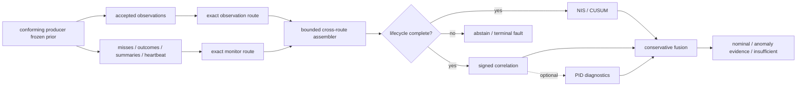

<p align="center">
  
</p>

<h1 align="center">galadriel</h1>

<p align="center"><strong>Galadriel's Mirror</strong> — an experimental cross-sensor consistency monitor for multi-sensor fusion.</p>

<p align="center">
  <a href="https://github.com/sepahead/galadriel/actions/workflows/ci.yml"></a>
  
  
  
  
  
</p>

Galadriel asks whether several sensors observing one track still agree. It combines
per-channel Normalized Innovation Squared (NIS) evidence with signed (sign-preserving)
cross-channel correlation over a producer-attested projection; optional PID diagnostics
explore nonlinear dependence. ("Signed" and "attested" here mean the sign of the
correlation and a producer provenance claim — not a cryptographic signature.)



## Ecosystem boundaries

Galadriel has one local evidence path and no command-authority path. A dependency pin,
shared transport, or historical fixture does not by itself prove an authorized or current
cross-repository integration.

| Project | Direction | Required or optional | Why connected | Explicit 0.9.0 boundary |
| --- | --- | --- | --- | --- |
| [pid-rs](https://github.com/sepahead/pid-rs) | Upstream algorithm library | Not used by the default CLI build; its exact `pid-core` pin is required by the PID, justification, and evaluation crates and by the CLI `pid` feature. It is linked code, not a runtime service. | Supplies restricted-domain KSG mutual-information and PID primitives for additive research diagnostics. | Pin `1cd2424f7967e1752dcc8e53859e8fdad3566f51` declares 1.0.0 and transitively resolves `pid-runlog` 1.0.0 from the same revision; no public v1 tag or published upstream 1.x artifact is claimed. |
| [NCP](https://github.com/sepahead/NCP) | Upstream wire/transport libraries | Not used by the default CLI build. `ncp-core` is required by `galadriel-ncp`, evaluation, and CLI `ncp`; `ncp-live` additionally pulls `ncp-zenoh`, Zenoh, and Tokio. | Supplies wire-0.8 key/version/contract helpers and the optional Zenoh bus. Galadriel owns its sidecar envelopes, bounded offline JSONL, and operational receiver. | Both NCP crates pin `2f5bd586d4bb20c90362bb6f5698b7f64057ba4e`; this does not prove remote authorization, ACL enforcement, or wire-1.0 compatibility. |
| [Crebain](https://github.com/sepahead/crebain) | External upstream producer relationship | No Cargo dependency; not required for demo, simulation, evaluation, or replay. Live operation needs an authorized contract-conforming producer, not necessarily Crebain by code identity. | Provides the inspected reference component for the observation/monitor sidecar contract and byte-identical retained registry fixture. | Crebain's formal 0.9 boundary freezes an earlier Galadriel audit head; no reciprocal final-candidate or deployment qualification is claimed. |
| [Haldir](https://github.com/sepahead/haldir) | Prospective downstream authorization consumer | No dependency, adapter, route, or runtime edge in 0.9.0. | Defines the intended future record-only and independently admitted restrict-only boundary; tests ensure Galadriel evidence cannot grant or widen authority. | The integration phase has not started and there is no runtime evidence. |
| [Prisoma](https://github.com/sepahead/prisoma) | Prospective downstream offline comparator/covariate consumer | No dependency, adapter, route, or runtime edge in 0.9.0. | Documents a possible future immutable offline covariate import and keeps Galadriel sidecars outside normative NCP `SensorFrame`s. | Relationship E0; shared NCP/PID dependencies imply neither schema compatibility nor independent-implementation replication. |

The 2026-07-18 read-only coordination cut inspected NCP
`10492c81ac671ef1909962a9f1fede33781b9933`, Crebain
`0a58a5b8dd799884ddb06f1308b1748216fab322`, Haldir remote `main`
`dd3d8a1c993721f89a1edb04dec5247761c694ad`, and Prisoma
`63cff105e0e40281376e6f827d7782e9b351961a`. These mutable repository heads are
provenance for the inspection, not Galadriel release inputs or reciprocal compatibility
pins. NCP's wire-1.0 topology remains proposed and incompatible with the current named
wire-0.8 sidecars; Crebain retains component-level schema-v1 alignment but freezes
Galadriel `94e2f8cc01f352d2bf899b7f656997f143a2588f` only as an audit input; Haldir has
no adapter; and Prisoma has no direct sidecar path. Current reciprocal integration and
final cross-repository qualification remain `NOT_CLAIMED`.

The exact route, lifecycle, and downstream-effect rules are in
[`docs/PRODUCER-CONTRACT.md`](docs/PRODUCER-CONTRACT.md) and
[`docs/ADVISORY-BOUNDARY.md`](docs/ADVISORY-BOUNDARY.md). The dated evidence and
claim-by-claim interpretation are recorded in
[`docs/ECOSYSTEM-CONNECTIONS.md`](docs/ECOSYSTEM-CONNECTIONS.md). Current external
repository heads may move independently; 0.9.0 claims only the dependency revisions and
local evidence named here.

## Run the verified demo

```bash
cargo run --locked --bin galadriel -- demo --frames 128 --seed 7
```

Representative output from that exact command (traces shortened here):

```text
═══ GALADRIEL'S MIRROR · cross-sensor consistency monitor ═══
┌─ CLEAN — corroborated airspace picture
│  visual    μ=2.93  ● consistent
└▷ VERDICT: NOMINAL
┌─ PHANTOM DOA — targeted single-channel spoof (acoustic)
│  acoustic  μ=66.68 ● ANOMALOUS
└▷ VERDICT: ATTRIBUTED-INCONSISTENCY (spoof-like evidence; cause unclassified) [acoustic]
┌─ BROADBAND JAM — correlated all-channel denial
└▷ VERDICT: BROAD-DEGRADATION (jam-like evidence; cause unclassified)
┌─ SYNTHETIC MOMENT-MATCHED SPOOF
│  baseline: NOMINAL — blind (NIS stays in-covariance)
└▷ correlation: ATTRIBUTED-INCONSISTENCY [acoustic]
```

The demo uses synthetic, common-frame observations. It demonstrates code paths, not
field performance.

## Evidence status

Run the versioned study with the single locked command in
[`docs/POST-AUDIT-EVIDENCE.md`](docs/POST-AUDIT-EVIDENCE.md). Publication runs refuse
a dirty worktree and write a checksummed manifest beside the machine-readable trials.
The clean-source reference artifact is
[`evidence/results/post-audit-v1-8a0084f`](evidence/results/post-audit-v1-8a0084f),
generated from commit `8a0084f` with `dirty=false`.

- The post-audit runner records its Git commit, toolchains, complete configuration,
  fixed seed domains, per-trial outcomes, holdout summaries, and checksums in one command.
- The retained `8a0084f` diagnostic artifact uses its historical trial-v1 numeric-seed
  wire. New runner output uses trial v3 with exact decimal-string and fixed-width
  hexadecimal seeds; the two schemas are not silently conflated.
- Synthetic stream studies report false-alert episodes/track-hour, mission false-alert
  probability, run length, conditional delay, abstention, attribution, autocorrelation,
  covariance-scale sensitivity, and provenance rejection separately.
- The bundled Crebain fixture proves bounded parsing and baseline replay only. It is
  roughly 15.8 seconds long and has no attested common projection, so recorded full-detector
  stream metrics are explicitly `not_estimable`, never replaced with synthetic numbers.
- Galadriel contains the bounded consumer for an opt-in common-projection and lifecycle
  producer. Crebain `4c311900ade5668200a48d56fb191be1916b884a` and Galadriel
  `81437d807ca83b66b45c8353968948e540072d97` are a retained historical compatibility
  fixture, not a reciprocal pin of this 0.9.0 candidate. Current cross-repository
  qualification is `NOT_CLAIMED`. In-process tests remain component evidence, not a
  receiver-verified external mTLS/ACL deployment or field study.

The artifact is a diagnostic result, not an acceptance result. In its independent clean
arm, the current default reports 26.26 alert episodes/track-hour and a 0.9167 mission probability
of at least one alert; the `phi=0.5` and `phi=0.85` autocorrelated arms report 102.95 and
262.57 episodes/track-hour. Ordinary acoustic missingness drives 99.35% fused monitoring
abstention. These results expose repeated-look and availability calibration work that must
be completed before any operational use.

> **Honest scope.** Galadriel detects statistical inconsistency, not truth. It cannot
> prove that an attributed channel is malicious, cannot detect an attacker that preserves
> cross-channel consistency, and must not silently veto a control path. Reports are
> advisory evidence, not calibrated posteriors.

> **Current integration status.** Galadriel implements the strict two-route consumer,
> registry pin capability, lifecycle adapter, and bounded operational receiver. The
> previously paired Crebain/Galadriel revisions are retained only as a historical
> compatibility fixture; they do not identify or qualify this candidate. A current
> reciprocal pin, final cross-repository qualification, real-router certificate/ACL
> campaign, and recorded stream calibration are all `NOT_CLAIMED`. Historical captures
> remain `not_estimable`, and deployments remain responsible for fresh, non-reused epochs.

> **TLS trust limitation.** The pinned Zenoh 1.9 client trusts built-in public WebPKI
> roots in addition to the configured deployment CA. Exclusive router-certificate/CA
> pinning is `NOT_CLAIMED`; use a private, non-publicly-issuable router name with
> controlled resolution or an external exact-certificate/SPKI pinning layer. See the
> [secure deployment runbook](docs/SECURE-DEPLOYMENT.md#tls-server-authentication-limitation).

How Galadriel expects to be consumed by a downstream authorization gate — as
non-authoritative, record-only, never `ALLOW`-widening advisory evidence — is specified in
[`docs/ADVISORY-BOUNDARY.md`](docs/ADVISORY-BOUNDARY.md).

The research background and study design are documented in
[`docs/PAPER.md`](docs/PAPER.md), [`docs/JUSTIFICATION.md`](docs/JUSTIFICATION.md), and
[`docs/EVALUATION.md`](docs/EVALUATION.md).

## What the core requires

Galadriel consumes `PidObservation` records containing NIS and degrees of freedom.
Cross-sensor analysis additionally requires an optional `consistency_projection`:
a bounded signed vector plus non-zero physical-frame, projection-context, and frozen-prior
identifiers. Native `innovation` / `innovation_cov` fields remain diagnostic and are never
used as a cross-modal fallback. The detector requires:

- one track per assessment;
- strictly increasing, unique sequence numbers per track and modality;
- finite, valid observations with stable degrees of freedom;
- exact sequence alignment for cross-channel windows;
- matching projection dimension, frame ID, and context ID across modalities;
- one matching frozen-prior ID per sequence, never reused at another sequence;
- enough fresh observations from all configured modalities.

Invalid configuration or input returns `Err(...)`; it is not converted into a verdict.
Missing, stale, geometrically incomparable, lifecycle-incomplete, or statistically
insufficient evidence returns `InsufficientEvidence`/an explicit abstention, not `Nominal`.
The legacy `CREBAIN_PID_JSONL` capture remains a baseline-only path. Lifecycle-complete
operational evidence requires a separately qualified two-route producer plus Galadriel's
assembler; no current reciprocal producer qualification is claimed, and the consumer never
infers a successful lifecycle stage from a missing record.

## Detector layers

### NIS/CUSUM magnitude layer

For each track and modality, a sliding NIS window is compared with its chi-square
reference and monitored for sustained shifts. Per-assessment channel tests control the
family-wise significance budget. A report is `Nominal` only when every configured
channel is fresh, ready, and consistent.

| Evidence | Verdict |
|---|---|
| all configured channels ready and consistent | `Nominal` |
| minority of channels anomalous while peers remain usable | `AttributedInconsistency { channels }` |
| most/all channels inflated together | `BroadDegradation` |
| positive but non-attributable or lower-direction evidence | `UnclassifiedAnomaly { channels }` |
| too little, stale, missing, or incompatible evidence | `InsufficientEvidence` |
| invalid input or configuration | `Err(...)` |

### Signed-correlation consistency layer

The default consistency layer uses signed Pearson correlation, family-wise
significance, and a unique strict-majority positive-consensus clique. Negative
correlation is not accepted as corroboration. A dyad, a tied clique, or a collection
with no coherent positive consensus cannot support outlier attribution.

Every producer-declared projection axis is assessed. The significance budget is
Bonferroni-split across axes and channel pairs. Different positive channel attributions
across axes, or a positive axis beside an insufficient axis, become
`UnclassifiedAnomaly` rather than `AttributedInconsistency`.

`galadriel_core::assess_default` fuses magnitude and consistency evidence without
turning an unavailable consistency assessment into `Nominal`. Its sealed
`DefaultReport` carries an opaque `AssessmentBinding` over the complete accepted
`ReleaseSuite` and every field of every ordered input observation. The magnitude and
correlation components must carry that exact binding; unbound component helpers produce
diagnostic tuples only and cannot mint an accepted report.

### PID research layer

The optional `pid` feature adds geometry-gated KSG mutual information and
shared-exclusions PID atoms. MI/PID is sign-invariant and therefore **additive**: it
cannot repair missing geometry, create a consensus from a dyad, or override
contradictory signed correlation. Canonical synthetic studies show regimes where this
evidence may be useful; they do not show that those regimes occur in crebain output.
The path pins an immutable pid-rs revision whose `pid-core` manifest declares 1.0.0;
there is no public v1 tag or released upstream 1.x artifact. It declares the pinned
revision's restricted regular-continuous support model, records seeded Gaussian
observation noise as an estimand-changing model choice, and classifies PID2 atoms as
`experimental_restricted_domain`. Point gates use the pinned report-first KSG API;
bounded circular-resample confirmation remains an explicitly experimental raw-scalar
pipeline. Accepted PID reports add a `PidAssessmentBinding` over the core assessment
binding and the complete PID research suite. See the [0.4→1.0 migration
record](docs/PID_RS_1_0_MIGRATION.md).

## Project status

**Version `0.9.0`, pre-1.0 research release.** The `galadriel-core` source
surface is frozen for the 0.9.x line; supporting crates and wire adapters remain
experimental. Every workspace package sets `publish = false`, so this is a GitHub source
release rather than a crates.io publication. Unit, property, integration, and synthetic
study tests exercise the implementation, but no current evidence supports calling it
field-validated or production-ready. The normative [claims matrix](docs/CLAIMS.md),
[statistical contract](docs/STATISTICAL-CONTRACT.md), [threat model](docs/THREAT-MODEL.md),
and [API policy](docs/API-SURFACE.md) state the exact boundary. No project DOI or Zenodo
record is claimed yet.

Author and maintainer: **Sepehr Mahmoudian**.

| Crate | Role | Evidence level |
|---|---|---|
| [`galadriel-core`](crates/galadriel-core) | NIS/CUSUM, signed correlation, fused assessment | Tested research core |
| [`galadriel-sim`](crates/galadriel-sim) | synthetic scenarios and injections | Synthetic only |
| [`galadriel-cli`](crates/galadriel-cli) | `demo`, `replay`, and secure `observe` driver | Operator prototype; live path component-tested |
| [`galadriel-pid`](crates/galadriel-pid) | KSG-MI / PID evidence | Optional research path |
| [`galadriel-ncp`](crates/galadriel-ncp) | strict codecs, pinned registry, monitor tap, assembler, lifecycle gate, operational Zenoh receiver | Unit/golden/in-process Zenoh tested; no external deployment evidence |
| [`galadriel-eval`](crates/galadriel-eval) | Monte Carlo evaluation and cost bench | Synthetic only |
| [`galadriel-justify`](crates/galadriel-justify) | canonical forced-vs-justified studies | Synthetic/theoretical only |

The workspace MSRV is **Rust 1.89**. Mutable test totals and benchmark values are not
treated as project-status claims.

## CLI features and workspace dependencies

The table describes activation from the default-member CLI. Directly building
`galadriel-pid`, `galadriel-justify`, or `galadriel-eval` still resolves `pid-core`;
directly building `galadriel-ncp` or `galadriel-eval` resolves `ncp-core` even without a
CLI feature. Workspace-wide builds deliberately include those crates.

| Feature | Pulls | Adds |
|---|---|---|
| default | no sibling integration crates | core, simulator, CLI |
| `pid` | exact `pid-core` Git revision whose manifest declares 1.0.0; its upstream default set is empty and `parallel` remains off, while `experimental-pipelines` selects its continuous and mixed-dimension PID3 research surfaces | experimental KSG-MI/PID research layer; no upstream 1.x release claim |
| `ncp` | `ncp-core` | bounded JSONL ingest; NCP 0.8 key helpers; strict observation and producer-monitor envelopes; the CLI `replay` subcommand |
| `ncp-live` | `ncp-zenoh`, exact `zenoh` 1.9 guard types, `tokio` | secure `observe` command plus bounded two-route receiver, deadlines, lifecycle gate, and health state |

The pinned `ncp-core` manifest also declares opt-in `schema` and `ts` aliases. Neither
alias is selected by the audited offline, live, or evaluation dependency graphs.

The public `pid-rs` repository and NCP's `ncp-core`/`ncp-zenoh` crates are pinned by
exact Git revisions. The pid-rs revision declares 1.0.0 (there is currently no v1 tag),
while the NCP revision corresponds to public tag `v0.8.0`.
A fresh clone requires no sibling checkout, private repository token, or global Git
credential rewrite.

Run the operational observer only with the rendered observer config and the same exact
epoch/registry pin supplied to the intended external producer deployment:

```bash
export NCP_ZENOH_CONFIG=/secure/config/galadriel-epoch/zenoh-observer.json5
cargo run --locked --features ncp-live --bin galadriel -- observe \
  --realm engram/ncp \
  --epoch "$GALADRIEL_DEPLOYMENT_EPOCH" \
  --producer-id "$GALADRIEL_PRODUCER_ID" \
  --registry "$GALADRIEL_REGISTRY_PATH" \
  --registry-sha256 "$GALADRIEL_REGISTRY_DIGEST"
```

The renderer's checksummed `galadriel-handoff.json` binds that realm/epoch/producer/
registry tuple to the two authorized certificate CNs. Verify the complete digest manifest
and use the handoff as the deployment record before starting either process.

The command reports lifecycle abstentions as evidence insufficiency, labels every evaluated
result `calibrated_posterior=false`, exposes terminal health on exit, and stops on the first
ingress/assembly/liveness fault. Configuration generation and external authorization drills
are in [`docs/SECURE-DEPLOYMENT.md`](docs/SECURE-DEPLOYMENT.md).

The operational receiver subscribes one shared Zenoh session to the two exact keys
`{realm}/session/{epoch}/sensor/galadriel-{pid,monitor}`. Both callbacks serialize through
one bounded nonblocking ingress; the assembler enforces route provenance, contiguous
monitor sequencing, observation replay limits, registry/context/prior identity, producer
accounting, frame/reorder deadlines, and heartbeat silence. Its first terminal fault
invalidates queued events, so no later `FrameReady` crosses the boundary.
The fixed defaults allow 30 seconds for the first heartbeat after transport activation,
then require the declared one-second cadence within a three-second receipt deadline.
Replay high-water state never evicts within an epoch: operators must watch the CLI's
prior-identity and observation-stream utilization and coordinate a new epoch before a cap.
Live library callers must use a Tokio runtime with its time driver enabled.

After assembly, `LifecycleDetector` admits explicit typed `StreamPosition`s. Exact
successors advance normally; continuity changes require a generation-advancing reset, and
rollover requires an unseen epoch at sequence/generation zero. `reset_at`, `timeout_at`,
and `rollover_at` return bounded hash-linked `LifecycleReceipt`s; duplicate/replay/gap/
generation violations reject and latch. The legacy frame convenience path derives a local
position from frozen sidecar v1 fields, so these receipts do not claim new NCP wire fields.
Assessment receipts bind the complete serialized reports, and fault receipts bind the
exact returned reason. Standalone receipt decoding has a 16 KiB strict-JSON integrity gate;
it does not authenticate the writer or provide durability. Receipts remain in-memory audit
evidence, not a durable journal. See
[`docs/STATE-MACHINE.md`](docs/STATE-MACHINE.md).

Every live payload is a strict `galadriel_pid_observation` schema `1.0` envelope carrying
`ncp_version`, advisory `contract_hash`, `session_id`, `producer_id`, and the existing
historically Crebain-compatible `observation`; the exact independent-producer contract is
[`galadriel-pid-envelope-v1.schema.json`](crates/galadriel-ncp/schemas/galadriel-pid-envelope-v1.schema.json)
(a frozen producer-conformance schema; the runtime `SidecarEnvelope` validation gate is
the authoritative consumer-acceptance check).
The observation tap and assembler reject incompatible versions, undeclared fields, malformed
metadata, cross-session/cross-producer payloads, unsafe JSON integers, invalid observations,
and replay/sequence violations. Contract-hash drift is advisory and counted. The standalone
observation tap still exposes explicit secure/development modes and bounded handoff APIs;
the `observe` command instead always calls the strict secure constructor and requires an
externally pinned registry digest.
`LiveLimits::max_payload_bytes` bounds decoding after NCP callback delivery, but the
pinned `ncp-zenoh` callback currently materializes an owned payload first; deployments still
need a transport/broker message-size ceiling to bound receive-memory pressure. Subscriber
silence can still mean no traffic, a realm/key mismatch, ACL denial, or producer failure.
Producers must use a fresh, deployment-supplied session ID for every process epoch. Monitor
heartbeats make all-modal silence visible after the finite initial grace or configured
steady monotonic deadline.

Producer lifecycle and liveness use a separate strict
`galadriel_producer_event` schema `1.0` on
`{realm}/session/{epoch}/sensor/galadriel-monitor`. Its bounded codec and adjacent-tagged
heartbeat, outcome, miss, and frame-summary types are frozen in
[`galadriel-monitor-envelope-v1.schema.json`](crates/galadriel-ncp/schemas/galadriel-monitor-envelope-v1.schema.json).
The monitor tap, pinned registry, fail-closed assembler, lifecycle adapter, and operational
receiver implement the Galadriel consumer boundary described in
[`docs/PRODUCER-CONTRACT.md`](docs/PRODUCER-CONTRACT.md). The retained Crebain/Galadriel
commit pair is a historical component fixture only. The current candidate has no accepted
reciprocal producer pin or final cross-repository qualification, and none of the local
evidence attests a remote router's active ACL or calibrates the detector.

These are project-owned sidecar payloads, not normative NCP `SensorFrame`s. A conforming
producer must build the two exact named-sensor keys and publish the serialized envelopes
through `ZenohBus::put(..., Plane::Perception)`. It must not call
`put_sensor_named`, whose publisher gate correctly accepts only a complete NCP
`sensor_frame`.

## Building and testing

```bash
cargo fmt --all --check
cargo clippy --workspace --all-targets --all-features --locked -- -D warnings
cargo test --workspace --all-features --locked
RUSTDOCFLAGS="-D warnings" cargo doc --workspace --all-features --no-deps --locked
cargo build -p galadriel-core --no-default-features --locked
cargo deny --all-features --locked check
```

The workspace MSRV is **1.89**. Crate targets forbid unsafe code.

## Honest limitations

- **Consistency-preserving attacks remain invisible.** The
  [frustum attack](https://www.usenix.org/conference/usenixsecurity22/presentation/hallyburton)
  is a concrete example of an attack that preserves camera/LiDAR consistency.
- **Consistency is not truth.** A decoupled channel can represent a spoof, a true
  channel-specific event, a coordinate mismatch, or an estimator artifact.
- **Historical Crebain captures have no consistency projection.** The retained historical
  opt-in producer fixture computed a registered Cartesian projection from one frozen prior,
  but it does not qualify a current producer. Older JSONL fixtures remain baseline-only and
  Galadriel never falls back to their native mixed-frame vectors.
- **Gating censors evidence.** Association and chi-square rejection can turn the largest
  attacks into missing observations. Missingness is informative, not random.
- **Lifecycle absence is not health.** Explicit misses/rejections immediately break the
  affected statistical suffix. All-modal silence becomes a heartbeat fault in the
  operational receiver, but transport authentication still cannot prove physical truth.
- **Advisory attribution is not enforcement.** Authentication, ACLs, mTLS, a safety
  governor, and an independently reviewed control policy remain separate requirements.

## Producer and integration boundary

Galadriel 0.9.0 implements its local consumer contract: bounded live taps, cross-route
assembly, pinned-registry admission, lifecycle abstention, secure observer configuration,
and component/in-process test paths. The historical Crebain/Galadriel pair demonstrates an
earlier compatibility fixture; it does not close the current candidate across repositories.

The following remain explicit exclusions: a current reciprocal producer pin, final
cross-repository qualification, a retained multi-process mTLS/ACL allow-and-deny campaign,
recorded pre-gate calibration, and any API or publication promotion beyond this research
source release. See the [secure deployment runbook](docs/SECURE-DEPLOYMENT.md) for the
external procedure; none of those exclusions is converted into an implementation success.

## Documentation

- [`docs/CLAIMS.md`](docs/CLAIMS.md) — normative 0.9.0 claim tiers and non-claims.
- [`docs/CORE-CONTRACT.md`](docs/CORE-CONTRACT.md) — typed domain, outcome, failure,
  and exact assessment-provenance contract.
- [`docs/CONFIGURATION-CONTRACT.md`](docs/CONFIGURATION-CONTRACT.md) — immutable
  accepted configuration, named profiles, capability choices, identities, and bounds.
- [`docs/STATISTICAL-CONTRACT.md`](docs/STATISTICAL-CONTRACT.md) — exact report-field
  estimands, verdict functionals, and repeated-look boundary.
- [`docs/THREAT-MODEL.md`](docs/THREAT-MODEL.md) — adversaries, trust boundaries,
  required safe failures, and residual risks.
- [`docs/API-SURFACE.md`](docs/API-SURFACE.md) — stable core and experimental surfaces.
- [`docs/MIGRATION-0.9.md`](docs/MIGRATION-0.9.md) — source migration to typed 0.9
  identity, lifecycle, result, and PID APIs.
- [`docs/STATE-MACHINE.md`](docs/STATE-MACHINE.md) — positioned lifecycle admission,
  explicit reset/timeout/rollover, and bounded hash-linked receipts.
- [`docs/DEPENDENCY-POLICY.md`](docs/DEPENDENCY-POLICY.md) — immutable qualification
  pins, locked registry graph, and upstream release-claim boundary.
- [`docs/MOTIVATION.md`](docs/MOTIVATION.md) — threat grounding and scope.
- [`docs/PAPER.md`](docs/PAPER.md) — research argument and current evidence boundary.
- [`docs/JUSTIFICATION.md`](docs/JUSTIFICATION.md) — when MI/PID can add information.
- [`docs/PID_RS_1_0_MIGRATION.md`](docs/PID_RS_1_0_MIGRATION.md) — exact pinned-source
  PID API/scientific migration without an upstream 1.x release claim.
- [`docs/EVALUATION.md`](docs/EVALUATION.md) — reproducible synthetic methodology.
- [`docs/PRODUCER-CONTRACT.md`](docs/PRODUCER-CONTRACT.md) — frozen observation and
  lifecycle/liveness wire contract plus operational acceptance boundary.
- [`docs/SECURE-DEPLOYMENT.md`](docs/SECURE-DEPLOYMENT.md) — exact-epoch mTLS/ACL profile,
  runnable observer, health sequence, and external acceptance drills.
- [`docs/POST-AUDIT-EVIDENCE.md`](docs/POST-AUDIT-EVIDENCE.md) — one-command,
  checksummed streaming evidence artifact.
- [`docs/RELATED-WORK.md`](docs/RELATED-WORK.md) — competing and complementary methods.
- [`docs/ADVISORY-BOUNDARY.md`](docs/ADVISORY-BOUNDARY.md) — non-authoritative,
  non-widening downstream use and prohibited control connections.
- [`docs/ECOSYSTEM-CONNECTIONS.md`](docs/ECOSYSTEM-CONNECTIONS.md) — dated exact-cut
  provenance and the limits of each pid-rs, NCP, Crebain, Haldir, and Prisoma
  relationship.
- [`release/0.9.0/README.md`](release/0.9.0/README.md) — auditable handoff, ledger,
  claims, evidence, and version-adaptation record.

## License

Licensed under either [MIT](LICENSE-MIT) or [Apache-2.0](LICENSE-APACHE) at your
option. Part of the [`sepahead`](https://github.com/sepahead) ecosystem.
