# galadriel logo archive

This archive preserves earlier designs and captured design drafts.
The main repository README selects the active logo.
Archived artwork can contain superseded symbols or wording.
It does not establish current behavior, compatibility, authority, or release status.

[Manifest and exact source identities](manifest.json)

Each file retains its source bytes or an explicitly identified extraction from a historical portfolio SVG.
Extracted marks retain their source geometry, applicable styles, and referenced definitions.
No historical JavaScript was executed.
Dates identify the earliest captured source commit for those bytes, not necessarily the original design date.
Files use exact SHA-256 deduplication within this archive.

The archive excludes third-party marks, repeated platform icon sizes, and complete connection diagrams.
The manifest records any extraction gaps.

Select a preview to open the asset. Native SVG files retain scalable geometry.
Historical motion and accessibility behavior remain as originally stored.
The archive does not certify those older behaviors.

## GALADRIEL

| Preview | Design | Source |
| --- | --- | --- |
|  | [2026-07-08-001-profile-dark-cd237f6b77](galadriel/2026-07-08-001-profile-dark-cd237f6b77.svg) | [876fb164e2](https://github.com/sepahead/sepahead/blob/876fb164e2b839096ca6cc33c930572be6672273/assets/work-graph-dark.svg) |
|  | [2026-07-08-002-profile-light-64c3cb319b](galadriel/2026-07-08-002-profile-light-64c3cb319b.svg) | [876fb164e2](https://github.com/sepahead/sepahead/blob/876fb164e2b839096ca6cc33c930572be6672273/assets/work-graph-light.svg) |
|  | [2026-07-08-003-profile-dark-3c90ec23ec](galadriel/2026-07-08-003-profile-dark-3c90ec23ec.svg) | [517db53062](https://github.com/sepahead/sepahead/blob/517db530626410c30335c4f30c61b59c54506686/assets/work-graph-dark.svg) |
|  | [2026-07-08-004-profile-light-f9224e925e](galadriel/2026-07-08-004-profile-light-f9224e925e.svg) | [517db53062](https://github.com/sepahead/sepahead/blob/517db530626410c30335c4f30c61b59c54506686/assets/work-graph-light.svg) |
|  | [2026-07-09-005-galadriel-logo-2ca42c35bf](galadriel/2026-07-09-005-galadriel-logo-2ca42c35bf.svg) | [44582d2384](https://github.com/sepahead/galadriel/blob/44582d2384c75c2b5bbdce921ad5e79b12e277f2/assets/galadriel-logo.svg) |
|  | [2026-07-09-006-profile-dark-854f5a90e6](galadriel/2026-07-09-006-profile-dark-854f5a90e6.svg) | [a0ec5d3544](https://github.com/sepahead/sepahead/blob/a0ec5d35445b9a5341b68694fa898b3a87fb8a7d/assets/work-graph-dark.svg) |
|  | [2026-07-09-007-profile-light-7533648310](galadriel/2026-07-09-007-profile-light-7533648310.svg) | [a0ec5d3544](https://github.com/sepahead/sepahead/blob/a0ec5d35445b9a5341b68694fa898b3a87fb8a7d/assets/work-graph-light.svg) |
|  | [2026-07-10-008-galadriel-logo-54f8b60b45](galadriel/2026-07-10-008-galadriel-logo-54f8b60b45.svg) | [2f433819dc](https://github.com/sepahead/galadriel/blob/2f433819dcfcbefb9a031595035b3cfd2d06c3d4/assets/galadriel-logo.svg) |
|  | [2026-07-10-009-galadriel-logo-3e5543b471](galadriel/2026-07-10-009-galadriel-logo-3e5543b471.svg) | [56ae13bc3c](https://github.com/sepahead/galadriel/blob/56ae13bc3cf8612d6a45e3f4b31b19178a028b7e/assets/galadriel-logo.svg) |
|  | [2026-07-10-010-profile-dark-b7d6392d1f](galadriel/2026-07-10-010-profile-dark-b7d6392d1f.svg) | [53625ad568](https://github.com/sepahead/sepahead/blob/53625ad5687d69a92ba09ec831ba269192191dba/assets/work-graph-dark.svg) |
|  | [2026-07-10-011-profile-light-5169c1e865](galadriel/2026-07-10-011-profile-light-5169c1e865.svg) | [53625ad568](https://github.com/sepahead/sepahead/blob/53625ad5687d69a92ba09ec831ba269192191dba/assets/work-graph-light.svg) |
|  | [2026-07-10-012-profile-dark-47fb8d3429](galadriel/2026-07-10-012-profile-dark-47fb8d3429.svg) | [52ad69ad9d](https://github.com/sepahead/sepahead/blob/52ad69ad9d4fb6c1995dbcc8a778232cbae015e5/assets/work-graph-dark.svg) |
|  | [2026-07-10-013-profile-light-071ff0860b](galadriel/2026-07-10-013-profile-light-071ff0860b.svg) | [52ad69ad9d](https://github.com/sepahead/sepahead/blob/52ad69ad9d4fb6c1995dbcc8a778232cbae015e5/assets/work-graph-light.svg) |
|  | [2026-07-10-014-galadriel-logo-25539e1f40](galadriel/2026-07-10-014-galadriel-logo-25539e1f40.svg) | [3cc09b548b](https://github.com/sepahead/galadriel/blob/3cc09b548b37ca29313c05b318daf11a3c3923a0/assets/galadriel-logo.svg) |
|  | [2026-07-10-015-profile-dark-68187cfb70](galadriel/2026-07-10-015-profile-dark-68187cfb70.svg) | [613a0bb239](https://github.com/sepahead/sepahead/blob/613a0bb239a0282b843a4058f4453b9828ff4bc4/assets/work-graph-dark.svg) |
|  | [2026-07-10-016-profile-light-73daf3bfac](galadriel/2026-07-10-016-profile-light-73daf3bfac.svg) | [613a0bb239](https://github.com/sepahead/sepahead/blob/613a0bb239a0282b843a4058f4453b9828ff4bc4/assets/work-graph-light.svg) |
|  | [2026-07-10-017-profile-dark-c8aa8521d9](galadriel/2026-07-10-017-profile-dark-c8aa8521d9.svg) | [7611abed0b](https://github.com/sepahead/sepahead/blob/7611abed0b67e4d7ffcc896033e188a7544620f8/assets/work-graph-dark.svg) |
|  | [2026-07-10-018-profile-light-41cf385317](galadriel/2026-07-10-018-profile-light-41cf385317.svg) | [7611abed0b](https://github.com/sepahead/sepahead/blob/7611abed0b67e4d7ffcc896033e188a7544620f8/assets/work-graph-light.svg) |
|  | [2026-07-10-019-profile-dark-9bf7c04ae4](galadriel/2026-07-10-019-profile-dark-9bf7c04ae4.svg) | [4d7894398e](https://github.com/sepahead/sepahead/blob/4d7894398e451f8c2833d2a5bcc87831d1b5345f/assets/work-graph-dark.svg) |
|  | [2026-07-10-020-profile-light-726a745664](galadriel/2026-07-10-020-profile-light-726a745664.svg) | [4d7894398e](https://github.com/sepahead/sepahead/blob/4d7894398e451f8c2833d2a5bcc87831d1b5345f/assets/work-graph-light.svg) |
|  | [2026-07-10-021-profile-dark-d02eaad08a](galadriel/2026-07-10-021-profile-dark-d02eaad08a.svg) | [dabc5b7cec](https://github.com/sepahead/sepahead/blob/dabc5b7cece7007ac098907db43cd7d8a43935d4/assets/work-graph-dark.svg) |
|  | [2026-07-10-022-profile-light-1a06b0d7d7](galadriel/2026-07-10-022-profile-light-1a06b0d7d7.svg) | [dabc5b7cec](https://github.com/sepahead/sepahead/blob/dabc5b7cece7007ac098907db43cd7d8a43935d4/assets/work-graph-light.svg) |
|  | [2026-07-10-023-profile-dark-af2c898a0d](galadriel/2026-07-10-023-profile-dark-af2c898a0d.svg) | [60b62678b5](https://github.com/sepahead/sepahead/blob/60b62678b51a869c2271f7ecc44dff18012bdc29/assets/work-graph-dark.svg) |
|  | [2026-07-10-024-profile-light-d9b74bb2cf](galadriel/2026-07-10-024-profile-light-d9b74bb2cf.svg) | [60b62678b5](https://github.com/sepahead/sepahead/blob/60b62678b51a869c2271f7ecc44dff18012bdc29/assets/work-graph-light.svg) |
|  | [2026-07-10-025-profile-dark-842b5d9cbf](galadriel/2026-07-10-025-profile-dark-842b5d9cbf.svg) | [91cb5b4a59](https://github.com/sepahead/sepahead/blob/91cb5b4a5917d8419403e09019b7d9c0fbafddba/assets/work-graph-dark.svg) |
|  | [2026-07-10-026-profile-light-3a84f10e47](galadriel/2026-07-10-026-profile-light-3a84f10e47.svg) | [91cb5b4a59](https://github.com/sepahead/sepahead/blob/91cb5b4a5917d8419403e09019b7d9c0fbafddba/assets/work-graph-light.svg) |
|  | [2026-07-10-027-profile-dark-64628a929b](galadriel/2026-07-10-027-profile-dark-64628a929b.svg) | [df0279f942](https://github.com/sepahead/sepahead/blob/df0279f94294bbd14c8effbb3bcf74c36220315d/assets/work-graph-dark.svg) |
|  | [2026-07-10-028-profile-light-87f340a5dd](galadriel/2026-07-10-028-profile-light-87f340a5dd.svg) | [df0279f942](https://github.com/sepahead/sepahead/blob/df0279f94294bbd14c8effbb3bcf74c36220315d/assets/work-graph-light.svg) |
|  | [2026-07-11-029-galadriel-logo-41f17ec026](galadriel/2026-07-11-029-galadriel-logo-41f17ec026.svg) | [cb4dcb75a1](https://github.com/sepahead/galadriel/blob/cb4dcb75a1bf8bf5860399b8d4070205bd71986b/assets/galadriel-logo.svg) |
|  | [2026-07-11-030-profile-dark-039471ab6c](galadriel/2026-07-11-030-profile-dark-039471ab6c.svg) | [2ebe00a6d7](https://github.com/sepahead/sepahead/blob/2ebe00a6d70e085e6def60b921009ba71e56a919/assets/work-graph-dark.svg) |
|  | [2026-07-11-031-profile-light-c308ce5f8d](galadriel/2026-07-11-031-profile-light-c308ce5f8d.svg) | [2ebe00a6d7](https://github.com/sepahead/sepahead/blob/2ebe00a6d70e085e6def60b921009ba71e56a919/assets/work-graph-light.svg) |
|  | [2026-07-11-032-galadriel-logo-882e9fafbb](galadriel/2026-07-11-032-galadriel-logo-882e9fafbb.svg) | [c4b0b3688d](https://github.com/sepahead/galadriel/blob/c4b0b3688d8fd5e3978512744525f6f2d1c5730d/assets/galadriel-logo.svg) |
|  | [2026-07-11-033-profile-dark-16db34714e](galadriel/2026-07-11-033-profile-dark-16db34714e.svg) | [5ae9135fef](https://github.com/sepahead/sepahead/blob/5ae9135fefd0e31d91ef552141f590bbacd5e0ac/assets/work-graph-dark.svg) |
|  | [2026-07-11-034-profile-light-4a9acd89f1](galadriel/2026-07-11-034-profile-light-4a9acd89f1.svg) | [5ae9135fef](https://github.com/sepahead/sepahead/blob/5ae9135fefd0e31d91ef552141f590bbacd5e0ac/assets/work-graph-light.svg) |
|  | [2026-07-12-035-profile-dark-03c7d21d94](galadriel/2026-07-12-035-profile-dark-03c7d21d94.svg) | [b2d19ccdd3](https://github.com/sepahead/sepahead/blob/b2d19ccdd3d19856664480dd3e14095cc307a4ba/assets/work-graph-dark.svg) |
|  | [2026-07-12-036-profile-light-311034cf64](galadriel/2026-07-12-036-profile-light-311034cf64.svg) | [b2d19ccdd3](https://github.com/sepahead/sepahead/blob/b2d19ccdd3d19856664480dd3e14095cc307a4ba/assets/work-graph-light.svg) |
|  | [2026-07-12-037-profile-dark-8a4b7d8e9d](galadriel/2026-07-12-037-profile-dark-8a4b7d8e9d.svg) | [6c173a05f1](https://github.com/sepahead/sepahead/blob/6c173a05f1655eac25d7b3bf7f551bb0cec2aeeb/assets/work-graph-dark.svg) |
|  | [2026-07-12-038-profile-light-f8ae556723](galadriel/2026-07-12-038-profile-light-f8ae556723.svg) | [6c173a05f1](https://github.com/sepahead/sepahead/blob/6c173a05f1655eac25d7b3bf7f551bb0cec2aeeb/assets/work-graph-light.svg) |
|  | [2026-07-13-039-profile-dark-28fbfc22a7](galadriel/2026-07-13-039-profile-dark-28fbfc22a7.svg) | [68ec2fb461](https://github.com/sepahead/sepahead/blob/68ec2fb461a19e6f5aa81da5f4ee7a2bac54a643/assets/work-graph-dark.svg) |
|  | [2026-07-13-040-profile-light-bf0e552608](galadriel/2026-07-13-040-profile-light-bf0e552608.svg) | [68ec2fb461](https://github.com/sepahead/sepahead/blob/68ec2fb461a19e6f5aa81da5f4ee7a2bac54a643/assets/work-graph-light.svg) |
|  | [2026-07-22-041-galadriel-logo-95a2916ead](galadriel/2026-07-22-041-galadriel-logo-95a2916ead.svg) | [1347987ffe](https://github.com/sepahead/galadriel/blob/1347987ffe4cb00b67d982b39fd8d8c773af4e10/assets/galadriel-logo.svg) |
|  | [2026-08-20-042-profile-dark-0e753d30da](galadriel/2026-08-20-042-profile-dark-0e753d30da.svg) | [6f89d6c19d](https://github.com/sepahead/sepahead/blob/6f89d6c19d8b87556f66c91e73486163400ec8d2/assets/work-graph-dark.svg) |
|  | [2026-09-05-043-profile-dark-3e6026d63d](galadriel/2026-09-05-043-profile-dark-3e6026d63d.svg) | [ed898bd827](https://github.com/sepahead/sepahead/blob/ed898bd827fd393b1a6262b48517a92c3b12d4b4/assets/work-graph-dark.svg) |
|  | [2026-09-05-044-profile-dark-136983fc0f](galadriel/2026-09-05-044-profile-dark-136983fc0f.svg) | [8740c531cb](https://github.com/sepahead/sepahead/blob/8740c531cbb5cc9b74a74fe8e4d4018940700483/assets/work-graph-dark.svg) |
|  | [2026-09-07-045-profile-dark-ae3c990989](galadriel/2026-09-07-045-profile-dark-ae3c990989.svg) | [4bcb7457ab](https://github.com/sepahead/sepahead/blob/4bcb7457ab2f55d856a9f52665ff18c0f186e063/assets/work-graph-dark.svg) |
|  | [2026-09-07-046-galadriel-logo-d3f4ea5c77](galadriel/2026-09-07-046-galadriel-logo-d3f4ea5c77.svg) | Local source `ccdce3af1b` |
