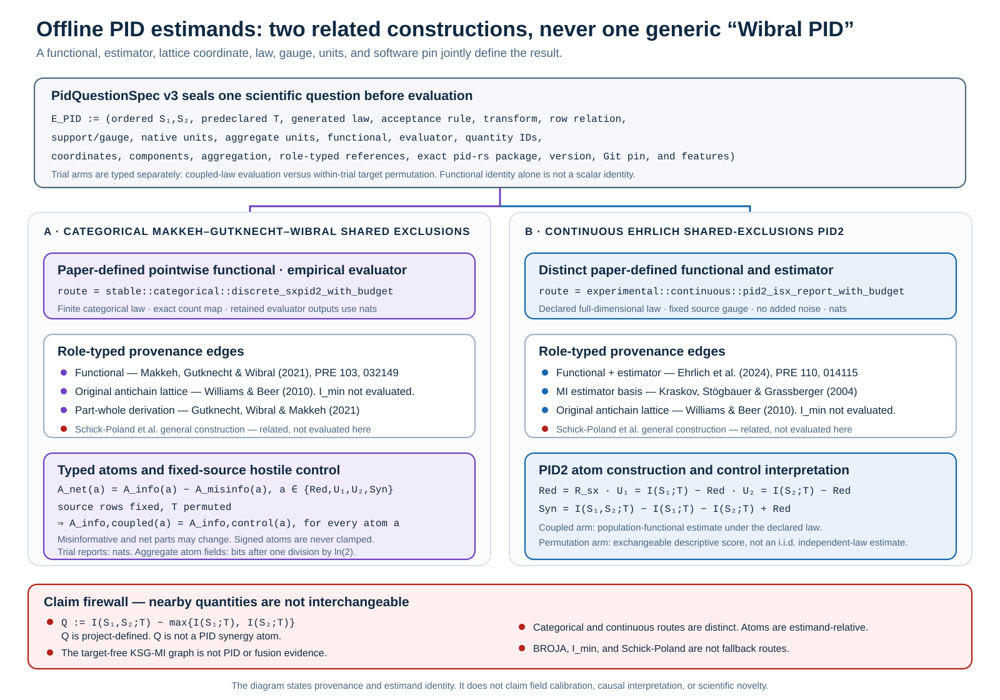

# When Partial Information Decomposition is justified or forced

Galadriel includes an optional pairwise-MI companion and separate offline Partial
Information Decomposition (PID) studies. These are different estimands and APIs.
This document gives the decision rule for each use.
It does not present pre-audit synthetic numbers as current detector evidence.
Galadriel selects `pid-core` 0.9.0 from pid-rs revision
`bc3aa80fb6025e709c2906a08bce25a4fac40578` for this path. Revision
`1cd2424f7967e1752dcc8e53859e8fdad3566f51` remains only in the immutable
CREBAIN producer preregistration and historical migration evidence.

> **Evidence status after the 2026-07 audit and 2026-08 exact-law adaptation.**
> The canonical studies are synthetic or theoretical.
> [`PID_RS_1_0_MIGRATION.md`](PID_RS_1_0_MIGRATION.md) records a fixed-seed
> pid-rs 0.4 to 1.0 reproduction.
> The reproduction is historical compatibility evidence, not calibration. The
> current opt-in in-process/library companion adds no noise, enumerates every
> circular deletion start, and never enters fusion. Its executable integrations
> are the synthetic demo, evaluation, and benchmark; `replay`, `observe`, and NCP
> do not invoke it. Real PID remains offline.
>
> It does not show that recorded Crebain residuals occupy a PID-justified regime.

[](../assets/pid-estimand-provenance.svg)

**Offline PID estimand and provenance graph.** `PidQuestionSpec` seals one source
order, target, and law before evaluation. The categorical lane evaluates the
Makkeh–Gutknecht–Wibral pointwise shared-exclusions functional on a finite law.
It retains reports in nats and converts only named aggregate atom fields to
bits. The continuous lane evaluates the related but distinct Ehrlich functional
and estimator on a declared full-dimensional law, fixed source gauge, and no
added noise; its Kraskov–Stögbauer–Grassberger (KSG) constituents and PID2 atoms
remain in nats. The categorical fixed-source hostile control preserves each
informative atom while allowing misinformative and net atoms to change. The
continuous permutation arm is an exchangeable descriptive score, not an
independent-law population estimate.
The bottom firewall separates both PID routes from project-defined `Q`, the
target-free MI graph, BROJA, `I_min`, and every unevaluated fallback.

[Open the PID estimand figure at full size.](../assets/pid-estimand-provenance.svg)

The figure abbreviates author lists to preserve legibility. These are the exact
reference roles:

- **Categorical functional definition:** Abdullah Makkeh, Aaron J. Gutknecht,
  and Michael Wibral, “Introducing a differentiable measure of pointwise shared
  information,” *Physical Review E* 103, 032149 (2021),
  [doi:10.1103/PhysRevE.103.032149](https://doi.org/10.1103/PhysRevE.103.032149).
- **Original antichain lattice:** Paul L. Williams and Randall D. Beer,
  “Nonnegative Decomposition of Multivariate Information” (2010),
  [arXiv:1004.2515](https://arxiv.org/abs/1004.2515). Galadriel uses the
  two-source lattice coordinates; it does not evaluate the Williams–Beer `I_min`
  functional.
- **Part-whole and formal-logic derivation:** Aaron J. Gutknecht, Michael Wibral,
  and Abdullah Makkeh, “Bits and Pieces: Understanding Information Decomposition
  from Part-whole Relationships and Formal Logic,” *Proceedings of the Royal
  Society A* 477, 20210110 (2021),
  [doi:10.1098/rspa.2021.0110](https://doi.org/10.1098/rspa.2021.0110).
- **Continuous functional and estimator:** David A. Ehrlich, Kyle Schick-Poland,
  Abdullah Makkeh, Felix Lanfermann, Patricia Wollstadt, and Michael Wibral,
  “Partial Information Decomposition for Continuous Variables based on Shared
  Exclusions: Analytical Formulation and Estimation,” *Physical Review E* 110,
  014115 (2024),
  [doi:10.1103/PhysRevE.110.014115](https://doi.org/10.1103/PhysRevE.110.014115).
- **Mutual-information estimator basis:** Alexander Kraskov, Harald Stögbauer,
  and Peter Grassberger, “Estimating mutual information,” *Physical Review E*
  69, 066138 (2004),
  [doi:10.1103/PhysRevE.69.066138](https://doi.org/10.1103/PhysRevE.69.066138).
- **Related general construction, not evaluated by either route:** Kyle
  Schick-Poland, Abdullah Makkeh, Aaron J. Gutknecht, Patricia Wollstadt, Anja
  Sturm, and Michael Wibral, “A partial information decomposition for discrete
  and continuous variables” (2021),
  [arXiv:2106.12393](https://arxiv.org/abs/2106.12393).

## Grounded exact-law case: three synthetic drone-sensor symbols

The historical caveat above still applies to recorded CREBAIN residuals. A new,
narrower fixture now answers a different question without pretending that those
residuals form a continuous PID-ready population.

CREBAIN commit `6ef60fabbf8c8a8008e7a77304d3e095b6b9e91d`
generates an exact 64-row, physically parameterized synthetic encoding of the
canonical laws `T_H = V AND R` and `T_V = V AND R AND A`. Each row has one
producer-declared fresh fusion engine, one prior, one row-level observation
timestamp, three pre-fusion sensor objects, ordered source symbols, latent ENU
truth, and a six-field legacy fusion summary. The target generator does not read
the source-symbol fields, sensor projections, fusion result, Galadriel verdict,
or PID output. The target is therefore external to fusion/PID, not
producer-independent field truth. The compact fixture lacks per-sensor
timestamps, complete projection receipts, a full fusion output, and enough
hidden state to prove state isolation. Eight repeats of each source cell test
bounded-summary fresh-instance reproducibility and custody. They do not supply
inferential precision. Galadriel embeds the exact 64,218-byte fixture and checks
SHA-256
`82a837415b56c3646386a5c3e6fe28a492906c164edc461249bab7844aa4ebda`,
checks each declared source symbol against its named coordinate, reconstructs
each target from latent truth, and invokes only the budgeted categorical MGW
routes `discrete_sxpid2_with_budget` and `discrete_sxpid3_with_budget`:

\[
\operatorname{PID2}_{\mathrm{MGW}}(V,R;T_H),
\qquad
\operatorname{PID3}_{\mathrm{MGW}}(V,R,A;T_V).
\]

The PID2 question is primary. PID3 is exploratory and does not close pid-rs's
separate 108-coordinate assurance program. KSG and continuous Ehrlich PID
are ineligible and are not executed because the fixture is a repeated atomic categorical law. `I_min` and
BROJA remain different, unrequested comparators rather than fallbacks.

[](../assets/crebain-mgw-method-map.svg)

**What PID adds—and does not add.** NIS answers a per-channel innovation-
magnitude question. The generic CUSUM component retains upper and lower fields,
and the lower arm is inert on the fusion core's `dof=3` route. It can move for
other admitted degrees of freedom. Signed correlation asks a directional linear cross-channel
consistency question. These are distinct operational diagnostics, none evaluated
by this fixture. KSG can answer an eligible pairwise continuous-dependence
question. Categorical MGW answers how a fixed,
producer-generated but fusion/PID-separated target's information is allocated
over ordered categorical sources. On the
horizontal AND law, the net atoms in nats are redundancy `0.084949518`, unique
visual `0.130812036`, unique radar `0.130812036`, and synergy `0.215761554`.
They reconstruct joint MI `0.562335145`. Pairwise or joint statistics can detect
dependence, but do not provide this MGW allocation. The allocation remains
measure-relative and non-causal, and it cannot alter fusion or Haldir authority.

All 66 **averaged** informative, misinformative, and net PID2/PID3 components,
plus ten subset mutual informations, agree with a dependency-disjoint,
separately implemented 80-digit Decimal event-union/Möbius calculation within
`1.97e-16` nats. Pointwise records are retained and internally reconstructed,
but the Decimal route does not recompute them. The maximum internal
lattice-reconstruction error is
`1.11e-16` nats. The emitted JSON additionally validates against the closed
Draft 2020-12 v2 schema at
`crates/galadriel-justify/schemas/crebain-drone-mgw-study-v2.schema.json` using
`repo_work/check_crebain_mgw_schema.py`. This is exact finite-law software
corroboration, not independent human or organizational replication or field
calibration.

[Read the complete row contract, equations, 18-coordinate PID3 table,
twenty-lens review, evidence ladder, citations, and to-do list.](CREBAIN-DRONE-MGW-STUDY.md)

## 1. For linear-Gaussian dependence, covariance determines population mutual information

For jointly Gaussian scalar variables,

\[
I(X;Y) = -\tfrac{1}{2}\log(1-\rho^2).
\]

Mutual information is a monotone function of correlation magnitude.
At the population level, MI and an absolute-correlation score rank
linear-Gaussian dependence identically.
A nonparametric Kraskov–Stögbauer–Grassberger (KSG) estimate adds finite-sample
variance and compute cost.
It cannot add population information that the covariance does not contain.

This theorem supports a model-selection rule.
It does not make a claim about recorded data.
Current Crebain output has not shown one common-frame, common-prior,
linear-Gaussian cross-modal residual process.

The runtime default is stricter than the analytical absolute-correlation
comparison.
It uses signed correlation.
A sign flip is operationally inconsistent even when MI and `|rho|` do not change.
The sign-invariant MI companion **MUST NOT** override that geometry.

## 2. Nonlinear dependence: MI can be justified

MI can add information when dependence is real but linear covariance does not
represent it.
Canonical examples include a nonlinear magnitude relation.
They also include randomized sign coupling with zero population correlation and
a constrained variable.

The synthetic study tests a report-first KSG estimate that passes the configured input gates.
The runtime companion calls pid-core's `ksg_mi_report_with_budget` route. Its
preflight estimate and executed report use the same explicit single-thread
`ResourceBudget`, while Galadriel's graph work ceiling remains a separate
aggregate bound. No Galadriel feature profile resolves `pid-runlog`.
It asks whether the estimate separates coupled windows from finite-sample
random-permutation controls. Conditional on the generated rows, those controls
are exchangeable and are not independent-law samples. The study accounts for
finite sample size, dimensionality, ties, and estimator uncertainty.
A positive result justifies MI research for that specified coupling.
It does not justify PID or a runtime security decision for arbitrary producer data.

## 3. Synergy: decomposition can be justified

Pairwise MI can also be blind.
In exclusive-or (XOR) or sign-parity constructions, neither source alone predicts
the target.
The source pair does predict the target.
Joint information can reveal this relation.
Galadriel's joint contrast
`Q = I(A,B;T) - max(I(A;T), I(B;T))` already reveals that pairwise blindness.
A named PID goes further only when the scientific question is how a specified
functional allocates the joint information among redundant, unique, and
synergistic atoms.

This case is a strong reason to use a joint or multivariate dependence statistic
instead of pairwise MI.
It does not, by itself, establish that a decomposition is necessary.
It is also narrow.
The target variable, source geometry, estimator, and atom semantics **MUST**
correspond to an actual system estimand.
A canonical XOR result does not show that a sensor-fusion residual stream
contains operational synergy.

Galadriel reports categorical Makkeh–Gutknecht–Wibral shared-exclusions
(`I^sx`) atoms and, in a separate study, the related-but-distinct continuous
Ehrlich–Schick-Poland–Makkeh–Lanfermann–Wollstadt–Wibral PID2 atoms as offline research
evidence.
That definition permits negative local or aggregate atoms.
The atoms are not probabilities, confidence values, or calibrated attack scores.

Every result carries a sealed, version 3 schema-tagged `PidQuestionSpec`: distinct
functional identity, a bounded graph of role-typed primary-reference edges with
complete teams, the explicit boundary that the Schick-Poland general construction
is not evaluated, the Williams–Beer original antichain lattice distinct from the
Gutknecht–Wibral–Makkeh part-whole derivation, exact pid-core sample-evaluator route,
ordered sources, a target fixed before result inspection and separated from any
accepted fused verdict, exact generated input law and finite-sample
selection/conditioning, source count, a typed list of every produced PID atom's
quantity ID, two-source lattice coordinate, construction, component set,
within-trial aggregation law, and native unit, exact root aggregate-field mapping,
coupled-law versus within-trial permutation-control interpretation, route configuration,
transform and row relation,
support/gauge statement, sign convention,
output-unit relation, native evaluator units, and atom-aggregate units. AUC and
bootstrap-interval fields are separately typed as dimensionless. The
categorical evaluator and every retained upstream trial stay in nats, while its
named aggregate atom fields convert once to bits. The continuous evaluator,
retained reports, and aggregates all stay in nats. Every categorical and
continuous pid-core evaluation uses the explicitly retained single-thread
`PidStudyResourceContract`. Aggregate study work is preflighted separately, so
the per-call receipt is not a whole-study memory or duration bound. The
categorical graph distinguishes the MGW
pointwise definition from both the original lattice and the later part-whole paper.
The continuous graph distinguishes Ehrlich et al. from its KSG estimator basis and
also records that its atom coordinates use the original lattice while not evaluating
the Williams–Beer `I_min` functional.
The fixed question's `PidDependencyIdentity` is a mechanically checked
package/version/Git-revision/feature selection envelope. Each produced study
separately retains a `PidExecutionIdentity`, reconciles pid-core's
build-context-dependent `SoftwareIdentity` to that selection, and requires the
declared `pid-core` package subtree to be clean at the selected WorkspaceGit
commit. This receipt is not whole-repository cleanliness, binary attestation,
scientific validity, or numerical portability.

A sibling `JustificationStudyProtocol` gives the Pearson comparator, pairwise-MI
composition, project-defined joint contrast `Q`, PID-question scope, and
permutation-control relation separate identities. It maps every non-PID root field,
including `Q` and joint-MI means, to a quantity, statistic, and unit. It also
serializes one independently generated coupled trial plus its within-trial control
as the sampling unit, the exact paired-index percentile AUC-bootstrap procedure,
generation/bootstrap seed domains, quantile selection, resample count, interval
scope, and absence of a multiplicity guarantee. The RNG API/version string is
descriptive; the exact resolved crate bytes and Galadriel source revision are not
bound by this result. Categorical MI and `Q` are
derived from the exact `DiscreteSxPid2Result` retained for that trial; there is no
second local entropy implementation. Serialized `q_*` fields name `Q`, while only
`sxpid_syn_*` or `isx_syn_*` fields name a PID synergy atom.
The paired categorical control keeps the exact source rows and permutes only the
target. A fixed-seed canary therefore requires all four MGW informative partial
atoms to agree between each coupled/control pair while permitting the
response-specific misinformative and net atoms to change. This is a
Galadriel-side use-case invariant; a later pid-rs fixed-law fixture can supply a
separate cross-repository check without being a prerequisite for this test.

Successful categorical and continuous result values are schema-tagged and
serializable. They retain every complete upstream `DiscreteSxPid2Result` or
`Pid2Report` used by their aggregate rows instead of reducing each trial to an
atom scalar. Each trial envelope carries its native nats unit so it cannot inherit
the categorical aggregate's bit label. Aggregate fields are private, and each
result can recompute every report-derived AUC, interval, and mean bit-for-bit
through `verifies_report_derived_aggregates`. Pearson rows are explicitly outside
that verifier because the current result does not retain their raw inputs.
`JustificationError` preserves a typed `GaladrielError` or `pid_core::PidError`
source instead of relabeling evaluator, resource, allocation, or numerical
failures as malformed channels. This is scientific result evidence, not yet a publication bundle:
the current command does not bind a Galadriel source tree, toolchain, executable,
hardware, or exact input-row bytes, and any trial error aborts the study rather
than emitting a typed per-trial error record.

## 4. Sequential evidence

Windowed estimators have refill latency after a change.
Local-information statistics can, in principle, supply a cumulative sum (CUSUM)
more quickly. The repository's current local kNN score is a project-defined
two-variable log-density-ratio heuristic. It is not the categorical MGW or
continuous Ehrlich PID construction.
This use requires a clean reference or calibration distribution.
It also requires validation of false-alarm behavior.
The canonical sequential study motivates future work.
It is not the runtime streaming algorithm.

Do not cite it as implemented streaming latency.

## 5. The significance floor and its independent and identically distributed assumption

The runtime default accepts a positive cross-channel edge only after it passes a
family-wise Fisher-z significance floor.
The standard error is `1/sqrt(n-3)`.
This error assumes independent and identically distributed (i.i.d.)
bivariate-normal residual pairs.

Windowed residual series do not have to be independent in time.
Here, producer-attested means a producer provenance claim.
It does not mean cryptographic authentication.
The producer-attested common-frozen-prior consistency residual has no whiteness guarantee.
See `PAPER.md` section 7.

The canonical autocorrelation-null study measures the effect under the null.
It uses two independent first-order autoregressive (AR(1)) channels.
Their population cross-correlation is exactly zero.
Their lag-1 coefficient is `phi`.
The study uses the detector's one-sided construction.
The default window is `n = 128`.

Bartlett's large-sample variance for this null is
`var(rho_hat) ~ (1 + phi^2) / ((1 - phi^2) n)`.
The source is M. S. Bartlett, "Some Aspects of the Time-Correlation Problem in
Regard to Tests of Significance."
It appeared in *Journal of the Royal Statistical Society* 98(3):536–543, 1935.
The approximation predicts these false-positive rates (FPRs) for the same construction:

| phi | predicted FPR at α=.05 | predicted FPR at α=.01 |
|----:|-----------------------:|-----------------------:|
| 0.3 | 0.066 | 0.017 |
| 0.5 | 0.101 | 0.036 |
| 0.7 | 0.168 | 0.087 |
| 0.9 | 0.297 | 0.226 |

The predicted direction is anti-conservative, and the effect is large.
At `phi = 0.9`, the approximation predicts activation more than twenty times too
often for the nominal 1% floor.
The bounded repository study uses at most 1,000 trials for each `phi`.
It checks the direction without claiming high-precision Monte Carlo estimates.

Replacing `n` with Bartlett's effective sample size improves calibration for
moderate persistence.
The value is `n_eff = n (1 - phi^2) / (1 + phi^2)`.
This method is not an exact finite-sample correction.

At `phi = 0.9`, `n_eff` is only about 13.4.
The deterministic 1,000-trial seed-7 study is conservative at this value.
It gives `FPR@.05 = .023` with Wilson interval `[.015,.034]`.
It gives `FPR@.01 = .001` with interval `[0,.006]`.

The tests require the moderate-persistence improvement.
They also require this high-persistence finite-sample limit.
They do not claim universal recalibration.

This result quantifies a disclosed limitation of the runtime default.
It does not change that default.
An operational correction **MUST** estimate `phi` from data.
That estimate has its own uncertainty.
The correction is therefore a registered enhancement decision.
It is not a documentation fix.

## 6. Operational decision rule

The proposed rationale, rejected alternatives, provisional profile choices, and
twenty-lens reopen checklist are in
[`METHOD-SELECTION-DECISIONS.md`](METHOD-SELECTION-DECISIONS.md). This section is
the compact operational ordering. It does not replace that decision record.

Use the least complex statistic that observes the registered estimand:

1. Use Normalized Innovation Squared (NIS) and CUSUM to assess per-channel
   magnitude changes in accepted observations.
2. Use signed correlation when comparable residuals have an expected positive
   linear consensus.
3. Add the MI companion only when recorded evidence shows meaningful nonlinear
   dependence that signed correlation misses. Keep it outside the accepted default report
   until a frozen representative streaming study qualifies incremental value.
4. Add PID only for a documented joint target and ordered source question. Name
   the categorical MGW or continuous Ehrlich functional, evaluator, law,
   transforms, gauges, row relation, units, and software identity.
5. Return an error for invalid input.
6. Return `InsufficientEvidence` for an unavailable estimand.

The symmetric MI graph and offline PID atoms cannot:

- repair mixed coordinate frames or sequentially changing priors
- create evidence for a missing, degenerate, non-finite, or short modality series
- infer a minority when only two channels are requested. A 2-of-3 clique can be
  the unique largest strict majority under the declared graph rule.
- resolve tied or contradictory consensus geometry
- change unavailable geometry or an unstable exhaustive deletion into an
  optimistic graph event
- change a signed-correlation contradiction into corroboration

## 7. Required producer evidence

Before bound runtime dependence research, the selected conforming producer **MUST** emit:

- `consistency_projection` in the normal runtime path for each requested modality
- matching nonzero physical-frame and projection-context identifiers
- matching frozen-prior identifiers within each sequence
- no reuse of a frozen-prior identifier across assessed sequences
- explicit association misses and gate rejections
- a heartbeat, stable session identity, and a versioned schema

The checked-in historical fixture intentionally enables native research fields.
It has no attested common projection.
Galadriel does not use its mixed-frame, sequential-prior innovations as a
fallback.
The fixture supports bounded parsing and basic NIS baseline checks only.
Unbound correlation diagnostics return `InsufficientEvidence`; direct MI inputs
must carry an explicit caller-declared episode and law.
Raw replay has no complete assessment scope.
It cannot construct an accepted core or dependence companion report.

## 8. Reproduce the canonical studies

```bash
cargo run --locked -p galadriel-justify --release
cargo run --locked -p galadriel-justify --release --bin galadriel-crebain-mgw
cargo run --locked -p galadriel-justify --release --bin galadriel-crebain-mgw -- --format markdown
cargo test -p galadriel-justify --locked
```

Regenerated results intended for citation **MUST** place the serializable PID
results inside a separate, versioned publication bundle that records the
Galadriel commit/tree state, toolchain, build profile, executable identity,
hardware, trial count, window, and seeds. Do not fold this future MI/PID bundle
into the frozen streaming NIS/correlation evidence artifact.
They **MUST** also record resampling settings for AUC intervals and identify the
distinct no-noise KSG, categorical MGW, continuous Ehrlich, and local-MI heuristic paths.
They **MUST** record each inconclusive or error outcome.
Do not make exact numbers project claims before the audited implementation and
tests pass.
After they pass, label the numbers as synthetic.
