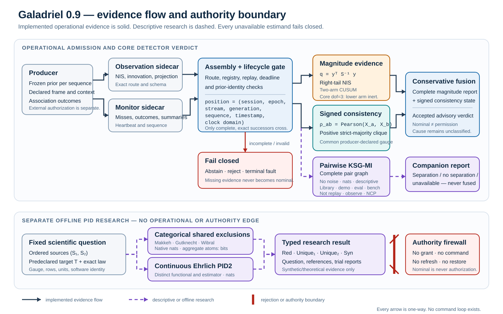
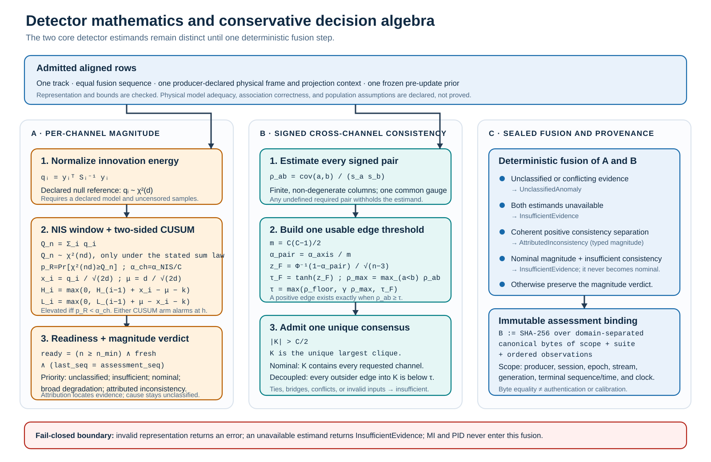
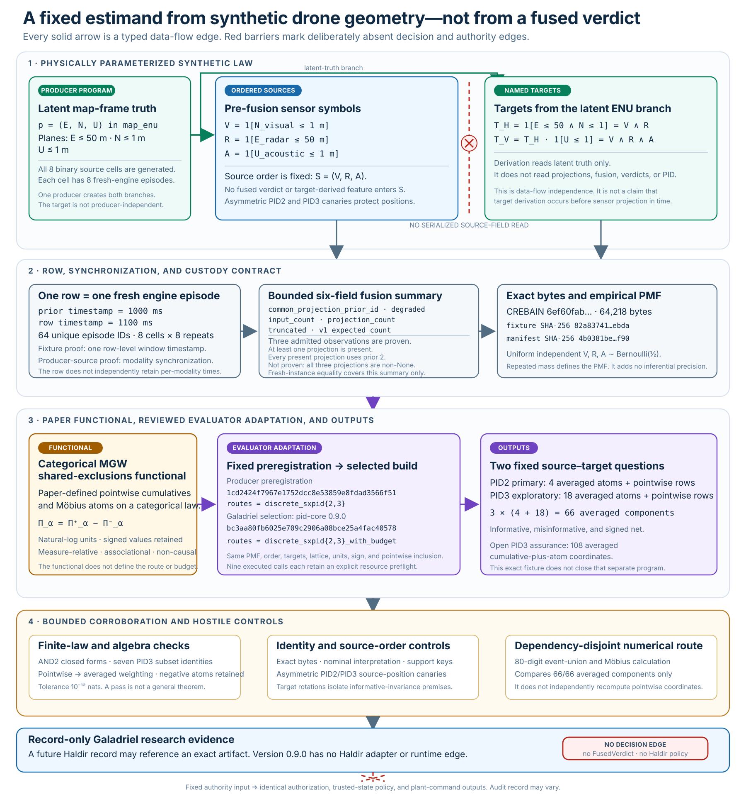

# Forced or justified? Mutual information versus correlation for cross-sensor consistency evidence

## Abbreviations

| Short form | Meaning |
|---|---|
| APIs | application programming interfaces |
| ed. | edition |
| `et al.` | and others |
| IEEE | Institute of Electrical and Electronics Engineers |
| LiDAR | light detection and ranging |
| Phys. Rev. E | Physical Review E |
| XOR | exclusive OR |

## Abstract

Cross-sensor consistency can show when one sensor stops agreeing with a corroborated majority.
The selected comparison statistic affects the result.
For jointly Gaussian scalar variables, mutual information (MI) is a monotone function of correlation magnitude.
Thus, a nonparametric mutual-information estimator adds cost and finite-sample uncertainty without new population information.
Nonlinear and synergistic dependence can justify mutual information or Partial Information Decomposition (PID).
The selected data population and target must define that estimand.

Galadriel is a pre-1.0 research implementation of this selection discipline.
Its default combines per-channel Normalized Innovation Squared (NIS) and cumulative sum (CUSUM) magnitude evidence.
It adds signed, family-wise-significant cross-channel correlation and unique strict-majority consensus.
An optional companion adds sign-invariant Kraskov–Stögbauer–Grassberger mutual
information (KSG-MI) as a descriptive pairwise graph. It does not change fusion.
Separate offline studies evaluate categorical and continuous shared-exclusions PID.
Invalid input returns an error.
Missing or geometrically insufficient evidence remains inconclusive.

The implementation has synthetic test and study evidence.
It does not have field validation.
A 2026-07 audit found that available historical Crebain captures do not support the cross-modal estimand.
The captures omit a producer-attested common projection.
Here, producer-attested means a producer provenance claim.
It does not mean cryptographic authentication.
They mix native coordinate frames, use sequential priors, and censor rejected measurements.

The bundled fixture supports bounded parsing and basic NIS baseline checks.
Its unbound correlation diagnostic returns `InsufficientEvidence`.
Raw replay has no complete assessment scope.
It cannot construct an accepted core or dependence companion report.
A retained historical opt-in Crebain revision implemented the required producer shape.
That shape used frozen-prior Cartesian projections and complete lifecycle information.
It does not qualify a current reciprocal integration.
No accepted recorded study exists.

[](../assets/system-boundary.svg)

**Figure 1 — Implemented evidence flow and explicit non-edges.** The solid upper
route is the only accepted operational detector path. Both sidecars must pass one
assembly and lifecycle gate before magnitude and signed-consistency evidence can
reach fusion. The dashed MI companion starts from admitted common-projection data,
but its three descriptive outcomes cannot change the fused verdict. The lower
dashed route is a separate offline PID study. Its categorical and continuous
functionals are distinct, and the authority barrier has no return or command edge.

[Open Figure 1 at full size.](../assets/system-boundary.svg)

## 1. Problem statement

A tracker receives measurements from several modalities.
For modality `c` and frame `t`, let an innovation be

\[
y_{c,t} = z_{c,t} - h_c(\hat{x}^{-}_t),
\]

with innovation covariance `S`.
Under a valid filter model, the NIS is

\[
\mathrm{NIS}_{c,t}=y_{c,t}^{\mathsf T}S_{c,t}^{-1}y_{c,t}
\]

It has a chi-square reference with the stated degrees of freedom [BarShalom2001].
NIS is a per-channel magnitude statistic.
A moment-matched dependence change can preserve that marginal.
It can still change the relation between modalities.

Galadriel does not calculate cross-channel dependence directly from `y`.
The producer must also attest a common signed projection

\[
r_{c,t}=g_{c,f,k}(z_{c,t})-\pi_{f,k}(\hat{x}^{-}_{p,t}),
\]

where `g` maps a modality measurement into the registered common Cartesian frame.
The `π` function maps the frozen predicted track state into the same frame, axes, and units.

This order is material for nonlinear sensors.
The producer converts a polar radar measurement to Cartesian coordinates before the common-frame subtraction.
Galadriel does not subtract mixed-unit native coordinates and then project the result.

Each modality at sequence `t` shares three identifiers:

- physical-frame identifier `f`
- projection or calibration-context identifier `k`
- frozen-prior identifier `p`

The wire field is a fixed three-value buffer with an explicit active dimension.
Galadriel rejects contradictory provenance.
It rejects reuse of one prior identifier at a different sequence.
It never substitutes modality-native innovations when the common projection is absent.

The defender must answer these questions:

1. What physical or statistical quantity is shared across modalities?
2. Are observations comparable for the same track, frame, coordinate system, and prior?
3. What is the least complex statistic that observes the expected relation?
4. Is there enough coherent evidence to attribute an outlier?
5. What outcome represents invalid or insufficient evidence?

Galadriel answers the last question with a fail-closed rule.
Errors remain errors.
Absent evidence is not nominal evidence.

## 2. Threat model

The attribution model assumes one unique strict majority of mutually corroborating channels.
It can identify a minority that decouples from that majority.
It does not establish the cause of decoupling.
It does not recover the true state.

These conditions are in scope:

- a per-channel magnitude shift
- a common-mode magnitude inflation
- a minority dependence change that breaks a valid positive consensus
- synthetic nonlinear regimes for optional MI and fixed-target synergistic regimes for offline PID research

These conditions are out of scope:

- a consistency-preserving attacker
- a colluding majority or ambiguous clique
- truth, authenticity, cryptographic identity, or state recovery
- a silent control-path veto
- all-modal silence without a separate producer heartbeat

The frustum attack [Hallyburton2022] preserves camera and LiDAR semantic consistency.
The cited result does not establish preservation of every Galadriel estimand.
Separately, any perturbation that preserves all evaluated statistics is outside this detector family's observation boundary.

## 3. Required producer contract

Cross-channel residual comparison is meaningful only when all samples refer to:

- one track and exact sequence
- one documented coordinate frame
- one common frozen pre-update prior
- compatible dimensions and covariance semantics
- an explicit observation lifecycle, including misses and rejections
- a stable session and schema version

Accepted whole-stream assessment also requires `AssessmentScope`.
The scope contains one producer and one exact `StreamPosition`.
The position contains session, epoch, stream, state generation, terminal sequence,
terminal timestamp, and clock domain.
Core checks the terminal sequence and timestamp against the stream.
The other coordinates are validated caller declarations.
They do not authenticate a producer or prove observation origin.

Historical and default `CREBAIN_PID_JSONL` output violates several requirements.
Radar's extended Kalman filter (EKF) innovation is polar.
Visual and acoustic residuals are Cartesian.
Updates occur sequentially.
The stream contains only associated, accepted, and successfully applied updates.

A separately gated operational producer must conform to the contract.
It must snapshot the immutable predicted state before association.
It must calculate registered Cartesian projections.
It must report misses and rejections on the monitor route.

`PidObservation::consistency_projection` represents the consumer-side contract.
The available historical Crebain captures do not populate this field.
Their native innovation fields remain baseline diagnostics only.
They do not produce cross-channel columns.

The bundled Crebain data supports bounded parsing and basic NIS baseline checks.
It does not show operational effectiveness for cross-modal correlation or PID.
Raw JSONL replay of this data remains an unbound diagnostic.
It cannot create an accepted whole-stream report.

## 4. Method

[](../assets/detector-evidence.svg)

**Figure 2 — Detector equations and decision algebra.** One admitted aligned row
set feeds two distinct core estimands. The magnitude route evaluates NIS, its
declared chi-square window reference, and two-sided CUSUM. The consistency route
evaluates every signed Pearson pair, a family-adjusted Fisher threshold, and one
unique strict-majority clique. The final column shows the fail-closed fusion
precedence and the domain-separated assessment binding. An invalid representation
is an error; an unavailable estimand is insufficient evidence. The Fisher
reference is conditional on the declared independent and identically distributed
bivariate-normal row model; the implementation does not prove that declaration.
MI and PID do not enter this algebra.

[Open Figure 2 at full size.](../assets/detector-evidence.svg)

### 4.1 Magnitude evidence

The streaming `Mirror` owns bounded state for each track and modality.
It rejects invalid or non-finite observations and non-increasing sequence numbers.
It rejects changed degrees of freedom and configuration outside documented domains.
The system assesses NIS windows and CUSUM evidence only for configured, fresh modalities.
It divides the assessment significance budget across channels.

Magnitude evidence distinguishes these outcomes:

- a minority high-direction anomaly, which produces `AttributedInconsistency` with spoof-like evidence and an unclassified cause
- broad high-direction inflation, which produces `BroadDegradation` with jam-like evidence and an unclassified cause
- positive but non-attributable or lower-direction evidence, which produces `UnclassifiedAnomaly`
- insufficient freshness or readiness, which produces `InsufficientEvidence`
- fully ready and consistent evidence, which produces `Nominal`

### 4.2 Signed correlation and consensus

Scalar channel series come only from the attested common projection.
The system forms them by exact sequence intersection for one track.
It rejects unequal, duplicate, non-finite, or provenance-incompatible channels.
A finite degenerate channel makes the related estimand insufficient.
The related axis withholds all channel corroboration values.
Legacy native innovations do not enter this path.

The default uses **signed** Pearson correlation.
Candidate positive edges must pass a configured floor.
They must also pass a family-wise Fisher-transform significance threshold.
Attribution requires one unique positive-consensus clique with more than half of the channels.

This rule prevents three earlier failure modes:

- a negative or sign-flipped channel that appears corroborated through `|rho|`
- a best-peer dyad that creates an apparent consensus
- a convenient pair that hides a failed third channel

A missing unique strict majority produces `InsufficientEvidence`.

The fused entry points analyze each active projection axis.
The correlation family budget is split across axes and channel pairs.
A coordinate-specific anomaly can leave other axes nominal.
Different positive channel attributions across axes remain `UnclassifiedAnomaly`.
A positive axis beside an insufficient axis also remains `UnclassifiedAnomaly`.
The system does not select an `AttributedInconsistency` result from these cases.

Accepted default reports use `galadriel-assessment-binding-v2`.
The binding covers the complete scope, release suite, and ordered observations.
Optional dependence reports nest that core binding and add the dependence-suite identity.
This binding supports internal recomputation.
It does not authenticate the producer.

The NCP lifecycle adapter derives scope from the admitted producer and exact position.
Each evaluated report uses the same producer and position as its receipt.
The receipt verifier checks bounded detector-shape and cross-field coherence.
It does not authenticate, sign, or durably retain a receipt.

### 4.3 Optional MI companion and offline PID evidence

For jointly Gaussian scalar variables [CoverThomas2006],

\[
I(X;Y)=-\tfrac{1}{2}\log(1-\rho^2).
\]

MI and correlation magnitude have the same population ranking in this model.
KSG [Kraskov2004] applies only when accepted data contains dependence that signed
linear correlation cannot represent. The caller declares the continuous
population, binary64 observation, and sampling models. Galadriel validates
sample geometry and size, requires a declared common coordinate gauge and applies the fixed identity transform,
and adds no noise. Exact ties abstain.

The executable companion uses pid-core's report-first
`ksg_mi_report_with_budget` at clean remote revision
`bc3aa80fb6025e709c2906a08bce25a4fac40578`. The retained
preflight and executed report share one explicit single-thread `ResourceBudget`.
The Galadriel graph ceiling is a separate aggregate bound. No resolved
Galadriel feature profile includes `pid-runlog`. The older `1cd2424f…` object is
retained only by the immutable CREBAIN producer preregistration and historical
migration record.

[Gao2018] characterizes the estimator's finite-sample and dimension-dependent bias.
The system does not replace estimator failure with an optimistic point estimate.

Partial information decomposition [WilliamsBeer2010] can describe redundant,
unique, and synergistic information. The categorical
Makkeh–Gutknecht–Wibral functional [Makkeh2021] and the related but distinct
continuous Ehrlich–Schick-Poland–Makkeh–Lanfermann–Wollstadt–Wibral construction and
estimator [Ehrlich2024] are not one
"shared-exclusions form." Galadriel evaluates them in separate offline studies.
The study must document fixed source identities and order, a target fixed before
result inspection and separated from any accepted fused verdict,
functional and evaluator, law, transforms, gauges, row relation, units, and
software identity. Its atoms are associational, statistical decomposition terms and can be negative.
They are not probabilities or calibrated attack confidence.

[](../assets/pid-estimand-provenance.svg)

**Figure 3 — Two related shared-exclusions constructions, not one generic
“Wibral PID.”** The sealed question fixes ordered sources, one preregistered
target that is separated from the accepted fused verdict,
the law, finite-sample acceptance, row relation, gauge, units, functional,
evaluator, atom coordinates, reference roles, and exact pid-rs pin. The left lane
is categorical Makkeh–Gutknecht–Wibral shared exclusions [Makkeh2021] on the
original Williams–Beer antichain lattice [WilliamsBeer2010], with the later
Gutknecht–Wibral–Makkeh part-whole derivation [Gutknecht2021] recorded separately.
The right lane is the related but distinct continuous Ehrlich functional and
estimator [Ehrlich2024], with KSG mutual-information constituents [Kraskov2004].
The Schick-Poland general construction [SchickPoland2021] and the Williams–Beer
`I_min` functional are not fallback evaluations. The bottom firewall also
separates both PID routes from the project-defined joint contrast `Q`, target-free
pairwise MI, and BROJA.

[Open Figure 3 at full size.](../assets/pid-estimand-provenance.svg)

[](../assets/crebain-drone-mgw-pipeline.svg)

**Figure 4 — A grounded exact-law PID case without a runtime claim.** CREBAIN
commit `6ef60fab…` generates a physically parameterized synthetic encoding of
all eight ordered visual/radar/acoustic source cells. The resulting law is
exactly `T_H = V AND R` and `T_V = V AND R AND A`. The producer computes the
targets from latent ENU truth without reading source-symbol fields, sensor
projections, fusion output, Galadriel, or PID. This makes the targets external
to fusion/PID, not producer-independent field truth. Galadriel checks each
declared source against its named pre-fusion coordinate, reconstructs the target
from retained latent truth, and evaluates categorical MGW PID2/PID3 through
budgeted pid-core 0.9.0 revision `bc3aa80f…`.

Each row retains one episode identifier, one observation timestamp, three
pre-fusion sensor objects, and a six-field legacy fusion summary—not separate
sensor timestamps, complete projection receipts, a full fusion replay, or the
hidden state needed to prove state isolation. The eight repeats per cell test
bounded-summary fresh-instance reproducibility and custody rather than
inferential precision.
All PID2 identities and all seven PID3 down-set identities hold. A
dependency-disjoint, separately implemented 80-digit Decimal
event-union/Möbius calculation agrees with all 66 **averaged** atom components
and ten subset mutual informations to `1.97e-16` nats. It does not recompute the
retained pointwise atoms and is not independent human or organizational
replication. The complete
standard-library oracle is retained in
`repo_work/check_crebain_mgw_decimal_oracle.py`. PID2 is the primary finite-law
result. PID3 remains exploratory and does not close the separate 108-coordinate
assurance program. The emitted JSON is also checked against a closed Draft
2020-12 v2 schema and exact schema-byte receipt. The red barrier makes the
non-edge to fusion explicit: a future Haldir record must leave authorization and
plant-command outputs unchanged, so PID cannot grant, revoke, restrict, or
exercise authority.

[Open Figure 4 and the complete equations, tables, method matrix, and evidence
ladder.](CREBAIN-DRONE-MGW-STUDY.md)

The opt-in in-process/library MI graph is symmetric, target-free, and
project-defined; it is not PID. Its only executable integrations in 0.9 are the
synthetic demo, evaluation, and benchmark; `replay`, `observe`, and NCP never
invoke it. Its threshold has no null calibration. Exhaustive deletion reports literal
sensitivity extrema, not a bootstrap confidence interval. Neither the MI graph
nor offline PID can override contradictory signed geometry, repair a missing
modality, or create majority attribution from a dyad.

### 4.4 Fusion

Fusion keeps magnitude and consistency evidence.
An unavailable consistency result cannot change a magnitude-nominal window into a fully fused nominal result.
Insufficient peer geometry does not erase positive anomaly evidence.
`Result` APIs separate invalid computation from a valid but inconclusive report.

## 5. Why MI or a separate PID study can still be justified

Three canonical cases motivate research beyond correlation:

1. **Nonlinear dependence.** One variable can constrain another while linear covariance is zero.
2. **Adversarial structure.** An attacker can target a known second-order statistic while leaving detectable higher-order dependence.
3. **Joint-only dependence.** A source pair can jointly constrain a target while
   each source remains uninformative. XOR and sign-parity constructions have this
   property. A joint statistic such as `Q` detects the relation; a named PID is
   needed only when the measure-relative atom allocation is itself the question.

These constructions show possibility, not prevalence.
A synthetic separation shows that an estimator can observe the constructed model.
It does not show the same source and target relation in a deployed fusion system.

Local information can also support sequential change detection [Page1954,
Moustakides1986]. The repository's current kNN local-MI CUSUM is a
project-defined two-variable heuristic, not the categorical MGW or continuous
Ehrlich–Schick-Poland–Makkeh–Lanfermann–Wollstadt–Wibral PID construction. It requires a registered clean reference and
stream-level false-alarm calibration. It is not the current runtime streaming mode.

## 6. Evaluation discipline

The harness evaluates explicit synthetic models for accuracy, latency, and cost.
The project removed exact pre-audit values after the correctness audit.
Do not cite them as current results.

The audit changed sequence alignment and signed consensus.
It changed family-wise thresholds and validation. The current correction removes
runtime PID labels, added observation noise, sampled deletion confirmation, and
MI fusion. It replaces them with a no-noise report-first MI companion and
deterministic exhaustive deletion sensitivity.

A regenerated report must disclose:

- commit, Rust toolchain, hardware, build profile, and complete configuration
- trial and seed policy
- separate error and inconclusive rates
- paired uncertainty for detector differences
- pre-onset accepted alarms for detector-latency measurements, and separately
  named pre-onset MI separation events for the uncalibrated companion
- the fact that post-onset MI latency is oracle-segmented at the known simulated
  onset and is therefore a posthoc sensitivity statistic, not an online latency
  comparable to the accepted alarm columns
- multiplicity for parameter-grid claims
- synthetic status in each result summary

The recorded-data gate is stronger.
The producer must supply common-prior and common-frame semantics before an operational claim is possible.
It must also supply explicit miss events, heartbeat, sessions, and schema.
See [`EVALUATION.md`](EVALUATION.md).

## 7. Limitations

- **Consistency is not truth.**
  Decoupling can be evidence of an attack, benign uniqueness, frame mismatch, filter error, or timing error.
- **Honest-majority boundary.**
  A colluding majority can invert attribution.
  An ambiguous topology remains inconclusive.
- **Selection bias.**
  Association and gating can hide attacks as missing data.
  The synthetic MI study therefore labels its AUC as selection-conditional,
  reports correlation on the same joint-complete trials, and gives worst/best
  MI-AUC bounds over arbitrary rankings of missing scores.
- **Temporal calibration.**
  The Fisher-z correlation significance floor assumes independent and identically distributed bivariate-normal residual pairs.
  Same-sign within-window autocorrelation reduces the effective sample size for two independent residual series.
  Thus, the significance of one assessment becomes anti-conservative.
  Opposite-sign autocorrelation can instead make it conservative.

  The canonical autocorrelation-null study uses the default window.
  It quantifies the equal-positive-persistence case in `galadriel-justify`.
  A Bartlett effective-sample-size correction [Bartlett1935] improves calibration for moderate persistence.
  It is conservative when high persistence leaves a small effective sample.
  See `JUSTIFICATION.md` section 5.

  The runtime floor remains uncorrected intentionally.
  Registration must first cover `phi` estimation and finite-sample calibration.
  A correctly tuned filter's native innovations are approximately white.
  The attested common-frozen-prior consistency residual is not one filter's innovation.
  It has no whiteness guarantee.

  A calibrated per-assessment significance does not guarantee a stream false-alarm rate.
  Overlapping windows and repeated looks require separate calibration.
- **Below-target magnitude shifts.**
  The windowed NIS test uses a right tail.
  The below-target CUSUM arm is inert at the default operating point.
  This point uses the fusion core's `dof = 3` and default symmetric CUSUM slack.
  See `DetectorConfig::cusum_slack`.

  Thus, the magnitude layer does not identify a moment-shrinking channel at this point.
  An over-conservative filter is one example.
  Another example is a replay or frozen sensor whose innovations match the prediction too closely.
- **Synthetic evidence.**
  Current studies do not represent field prevalence, base rates, maneuvers, or operator outcomes.
- **Liveness.**
  The operational receiver expects a producer heartbeat task that is independent
  of sensor input and the fusion loop.
  It fails closed on silence.
  Historical replay files have no live-liveness claim.
  No current reciprocal producer pin demonstrates heartbeat behavior across the actual router and certificate boundary.
  No retained external deployment campaign demonstrates this behavior either.
- **Transport prototype.**
  A retained historical Crebain revision contained a gated two-route publisher baseline.
  Galadriel implements a strict and bounded two-route receiver.
  That historical pair does not qualify the current candidate.

  The generated profile fixes mutual Transport Layer Security (mTLS) and exact-epoch access control lists (ACLs).
  It also fixes a 128 KiB transport receive ceiling.
  Component and in-process tests do not prove that a remote router loaded or enforced those files.

  The pinned Zenoh 1.9 client trusts built-in public Web Public Key Infrastructure (WebPKI) roots.
  It also trusts the configured deployment certificate authority (CA).
  Exclusive router pinning requires the runbook mitigation for a private name and controlled resolution.
  Alternatively, it requires an external exact-certificate or Subject Public Key Info (SPKI) enforcement layer.
  Local profile validation does not supply exclusive router pinning.

  The pinned `ncp-zenoh` callback materializes payload bytes before Galadriel's application size gate.
  Thus, the transport ceiling remains mandatory.
  New sequence streams fail closed at capacity.
  They do not evict replay high-water marks.
  Authenticated ACLs and a fresh deployment-supplied epoch remain operational requirements.
  They are not detector features.
- **Advisory only.**
  The verdict is not a calibrated posterior or enforcement command.

## 8. Roadmap to a defensible claim

1. **Implemented locally:** Galadriel has versioned strict schemas and pinned-registry capability.
   It has a bounded two-route assembler and receiver.
   It has typed lifecycle transitions and an exact-epoch security-profile configuration procedure.
2. **Historical fixture only:** Crebain `4c311900ade5668200a48d56fb191be1916b884a` and Galadriel `81437d807ca83b66b45c8353968948e540072d97` recorded an earlier compatibility pair.
   The pair covers epoch, registry, and common projection.
   It does not pin or qualify this candidate.
3. **Not claimed:** No current reciprocal producer pin or final cross-repository qualification exists.
4. **External evidence required:** Run the real multi-process campaign against exact current binaries.
   The campaign must test `allow`, `deny`, `wrong-certificate`, and `no-certificate` cases.
5. **Recorded evidence required:** Collect pre-gate streams and characterize selection effects.
   Evaluate maneuvers, lifecycle changes, and attacks independently of threshold fitting.
6. **Publication boundary:** Retain `publish = false` and the research classification.
   This source release does not promote a crate or adapter to an operational API.

## 9. Conclusion

The central selection rule survives the audit.
Do not pay for an information-theoretic estimator when a simpler statistic observes the registered estimand.
Use signed correlation for a valid positive linear consensus.
Add an MI companion only when recorded evidence shows a nonlinear bivariate
question. Add PID only when a fixed source-target question is genuinely
redundant, unique, or synergistic.
Remain inconclusive when geometry or evidence is absent.

Galadriel implements and tests that discipline as a research prototype.
Its consumer contract defines the required stream.
A current reciprocal producer qualification and an accepted recorded field study remain `NOT_CLAIMED`.

## Reproducibility

```bash
cargo run --locked -p galadriel-eval --bin galadriel-eval --release -- 200
cargo run --locked -p galadriel-justify --release
cargo run --locked -p galadriel-justify --release --bin galadriel-crebain-mgw
cargo bench --locked -p galadriel-eval --bench detectors
cargo test --workspace --all-features --locked
```

Numeric output is local synthetic evidence.
Record provenance before you report it.
Do not convert it into an operational detection or false-alarm rate.

## References

- **[BarShalom2001]** Y. Bar-Shalom, X.-R. Li, T. Kirubarajan. *Estimation with Applications to Tracking and Navigation.* Wiley, 2001.
- **[Bartlett1935]** M. S. Bartlett. "Some Aspects of the Time-Correlation Problem in Regard to Tests of Significance." *Journal of the Royal Statistical Society* 98(3), 536–543, 1935.
- **[CoverThomas2006]** T. M. Cover, J. A. Thomas. *Elements of Information Theory,* 2nd ed. Wiley, 2006.
- **[Ehrlich2024]** D. A. Ehrlich et al. "Partial information decomposition for continuous variables based on shared exclusions." *Phys. Rev. E* 110, 014115, 2024. [arXiv:2311.06373](https://arxiv.org/abs/2311.06373).
- **[Gao2018]** W. Gao, S. Oh, P. Viswanath. "Demystifying Fixed k-Nearest Neighbor Information Estimators." *IEEE Transactions on Information Theory* 64(8), 2018. [arXiv:1604.03006](https://arxiv.org/abs/1604.03006).
- **[Gutknecht2021]** A. J. Gutknecht, M. Wibral, A. Makkeh. "Bits and Pieces: Understanding Information Decomposition from Part-whole Relationships and Formal Logic." *Proceedings of the Royal Society A* 477, 20210110, 2021. [doi:10.1098/rspa.2021.0110](https://doi.org/10.1098/rspa.2021.0110).
- **[Hallyburton2022]** R. S. Hallyburton et al. "Security Analysis of Camera-LiDAR Fusion Against Black-Box Attacks on Autonomous Vehicles." *USENIX Security,* 2022. [arXiv:2106.07098](https://arxiv.org/abs/2106.07098).
- **[Kraskov2004]** A. Kraskov, H. Stögbauer, P. Grassberger. "Estimating mutual information." *Phys. Rev. E* 69, 066138, 2004.
- **[Makkeh2021]** A. Makkeh, A. J. Gutknecht, M. Wibral. "Introducing a differentiable measure of pointwise shared information." *Phys. Rev. E* 103, 032149, 2021. [arXiv:2002.03356](https://arxiv.org/abs/2002.03356).
- **[Moustakides1986]** G. V. Moustakides. "Optimal Stopping Times for Detecting Changes in Distributions." *Annals of Statistics* 14(4), 1986.
- **[Page1954]** E. S. Page. "Continuous inspection schemes." *Biometrika* 41(1/2), 1954.
- **[SchickPoland2021]** K. Schick-Poland, A. Makkeh, A. J. Gutknecht, P. Wollstadt, A. Sturm, M. Wibral. "A partial information decomposition for discrete and continuous variables." [arXiv:2106.12393](https://arxiv.org/abs/2106.12393), 2021.
- **[WilliamsBeer2010]** P. L. Williams, R. D. Beer. "Nonnegative Decomposition of Multivariate Information." [arXiv:1004.2515](https://arxiv.org/abs/1004.2515), 2010.
