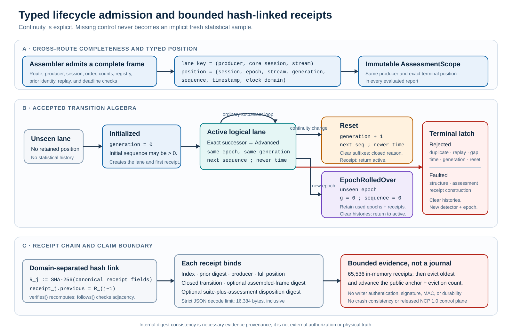

# Typed lifecycle admission and receipts

## Abbreviations

| Short form | Meaning |
|---|---|
| ACL | access control list |
| ASCII | American Standard Code for Information Interchange |
| JSON | JavaScript Object Notation |
| MAC | message authentication code |
| mTLS | mutual Transport Layer Security |
| NCP | Neuro-Cybernetic Protocol |
| NIS | normalized innovation squared |
| SHA-256 | Secure Hash Algorithm 256 |

Status: implemented Galadriel 0.9 adapter contract. This document defines the
typed lifecycle boundary in `galadriel-core::StreamPosition` and
`galadriel-ncp::LifecycleDetector`.

This contract does not make these claims:

- durable receipt persistence
- an authenticated lifecycle control plane
- a released NCP 1.0 integration
- external deployment qualification
- field calibration

`SHALL` and `SHALL NOT` identify requirements for the accepted 0.9 path.
Compatibility entry points have explicit labels. They do not add fields to the
frozen sidecar v1 wire format.

[](../assets/lifecycle-receipts.svg)

**Lifecycle and receipt map.** A complete cross-route frame creates one typed
position and immutable assessment scope. A new lane initializes only at generation
zero. An active lane accepts an exact successor, an exact generation-advancing
reset, or an unseen epoch rollover with zero sequence and generation. Rejection
or fault latches the lane and clears statistical history. Each encodable
transition appends a domain-separated receipt that binds its predecessor and
typed inputs. A failure before receipt construction has no lifecycle receipt.
The 65,536-receipt memory bound, 16,384-byte strict JSON decode limit, eviction
anchor, and nonclaims are part of the figure. The chain is internal provenance;
it is not authentication, a signature, a durable journal, or physical truth.

[Open the lifecycle figure at full size.](../assets/lifecycle-receipts.svg)

## 1. Typed position and logical lanes

**GLD-090-STM-001 — explicit coordinates.** Accepted lifecycle admission **SHALL**
use a `StreamPosition`. This value binds distinct typed values for session, epoch,
stream, state generation, sequence, timestamp, and clock domain. Raw strings and
integers **SHALL** pass through fallible domain constructors before detector use.

**GLD-090-STM-002 — bounded lanes.** `LifecycleDetector` **SHALL** partition state
by typed `ProducerId`, core session, and stream identity. Evidence from different
logical lanes **SHALL NOT** share retained statistical history.

**GLD-090-STM-003 — strict progression.** An ordinary frame in one epoch
**SHALL** have the exact next sequence. It **SHALL** have a strictly increasing
timestamp, the same clock domain, and the required state generation.

The detector **SHALL** reject and latch these conditions:

- a duplicate or replay
- a conflicting replay
- an older unretained position
- a forward gap
- a timestamp regression
- a bad generation
- a missing reset

The detector does not treat any of these conditions as an implicit fresh sample.

The logical lane key excludes epoch identity. An explicit rollover can replace an
epoch without a second lane. The lane retains this state:

- its active `StreamPosition`
- bounded track histories
- frame, context, and modality continuity
- registry identity
- recent frame fingerprints
- a non-evicting set of used epoch identities

The current bounds are:

| Retained state | 0.9 bound | Exhaustion behavior |
|---|---:|---|
| logical lifecycle lanes | configuration-derived, hard maximum 64 | Reject and latch. Do not evict another lane. |
| aggregate retained observations | 983,040 | Configuration or admission failure. |
| recent frame fingerprints per lane | 4,096 | The oldest fingerprint can leave the diagnostic cache. A later older arrival is conservatively `Reordered`. |
| used epoch identities per lane | 1,024 | Reject and latch. Never forget an epoch to permit reuse. |
| in-memory receipts | 65,536 | Evict the oldest receipt. Advance the public anchor and eviction count. |

The fixed modality domain contains the six values in `galadriel-core`. Accepted
release-suite construction supplies a nonempty canonical expected-modality set.
The lifecycle adapter checks aggregate history before it retains observations.

## 2. Accepted transition algebra

`LifecycleTransition` is the closed receipt vocabulary:

- `Initialized` means the first accepted position for one logical lane.
- `Advanced` means an exact same-generation successor.
- `Reset { reasons }` means an exact successor in the next state generation.
- `EpochRolledOver { previous_epoch_id }` means an unseen epoch at sequence zero
  and state generation zero.
- `Rejected { reason }` means a typed lifecycle or order rejection.
- `Faulted { reason }` means a fault after structurally valid admission reached an
  adapter, detector, or receipt operation. It includes the exact display reason.

Version 0.9 has no separate public lifecycle state enum with `Empty`,
`Collecting`, `Ready`, `Unavailable`, or `TimedOut`. Readiness remains a property
of sealed statistical reports and the retained suffix. A typed reset reason
represents timeout control.

Documents and consumers **SHALL NOT** infer a larger public state algebra from
internal track history.

### First position

A new logical lane accepts a valid position only at state generation zero. The
initial sequence can be nonzero. This behavior permits an explicitly positioned
late join. Initialization creates the lane and receipt before returning the
result.

### Ordinary advance

An `Advanced` frame uses the active epoch. It has the exact next sequence and a
newer timestamp. Its continuity context and state generation do not change.

`LifecycleDetector::assess_positioned_frame` binds the position epoch to the
assembled sidecar `session_id`. It also binds position sequence and timestamp to
the assembled frame before statistical assessment.

### Reset

**GLD-090-RST-001 — generation-advancing reset.** These changes **SHALL** require
the next state generation:

- physical frame
- projection context
- projection-registry digest
- expected-modality set
- inter-sample deadline excess

The old generation produces `MissingReset`. A skipped or reused generation
produces a typed mismatch.

An explicit caller-selected reset can also advance the generation without an
automatic continuity reason. The admitted reason set is closed and nonempty:

- `Explicit`
- `Timeout`
- `ProjectionFrameChanged`
- `ProjectionContextChanged`
- `ProjectionRegistryChanged`
- `ExpectedModalitiesChanged`
- `InterSampleDeadlineExceeded { gap_ms, maximum_ms }`

A detector-created reason set has at most five canonical reasons. Explicit and
timeout control operations produce singleton sets.

`reset_at` and `timeout_at` accept only one position. It must be the exact result
from `StreamPosition::checked_reset` for the active position. These operations
consume one sequence and increment generation exactly once. They require a newer
timestamp and clear retained statistical suffixes. They commit a receipt without
fabricating an assessment.

Generation exhaustion fails in the domain constructor. It never wraps or
saturates.

`timeout_at` does not observe a clock or infer silence. It records a timeout that
the caller's external deadline authority already established. The live receiver
and assembler handle transport heartbeat, reorder, and incomplete-frame timers.

### Epoch rollover

**GLD-090-EPC-001 — fresh epoch.** `rollover_at` **SHALL** preserve logical
producer, session, stream, and clock domain. It **SHALL** select an unused epoch
for that lane. The new epoch starts at sequence zero and state generation zero.

The operation clears track history, frame continuity, and recent frame
fingerprints. It retains the non-evicting used-epoch set and the global receipt
chain.

The detector rejects an `A -> B -> A` epoch sequence while it lives. A full
used-epoch set causes a fault. The detector does not evict old identities.

A rollover is not an automatic response to replay-map or counter exhaustion. It
does not prove that an external peer authorized the new epoch.

### Rejection and terminal fault

Lifecycle and order rejections produce `Rejected { reason }`. Structural,
assessment, or receipt failures produce `Faulted { reason }`. When receipt
construction succeeds, the chain binds the typed rejection. It also binds the
exact returned fault-reason string.

The detector latches the first error and clears retained statistical history.
Subsequent calls return that fault. The 0.9 detector cannot recover in the same
instance after a latched fault. Recovery needs an externally coordinated new
detector instance and a fresh epoch. Late repair is not sufficient.

This fail-closed behavior is not a transactional database claim. A rejection
appends audit evidence and clears statistical history. It never advances a valid
assessment or produces `Nominal`.

## 3. Lifecycle-complete assessment

`CrossRouteAssembler` first checks all route and frame invariants. These include
producer, session, monitor order, summary, counts, registry, projection, prior,
deadlines, and replay. Partial route data remains in staging. It never reaches
`LifecycleDetector` as a complete frame.

After typed admission, `LifecycleDetector` evaluates frozen tracks in
deterministic track order:

- With one assessable common projection for each expected modality, it passes the
  bounded contiguous suffix to `assess_default`.
- This call uses an accepted `ReleaseSuite` and returns
  `LifecycleAssessment::Evaluated`.
- With a missing, rejected, unsupported, or incomparable expected modality, the
  adapter clears the complete affected track suffix.
- It then returns `LifecycleAssessment::Abstained` with the canonical unavailable
  modalities.

The adapter creates one `AssessmentScope` before it evaluates the frame.
It uses the validated assembled-frame producer and the exact admitted
`StreamPosition`.
The same scope applies to every evaluated track in that frame.
Section 5 defines the local position that the sidecar v1 adapter derives.

Each evaluated `DefaultReport` contains this complete scope:

- producer
- core session
- epoch
- stream
- state generation
- terminal sequence
- terminal timestamp
- clock domain

The terminal sequence and timestamp equal the admitted frame position.
The scope does not add authenticated fields to the sidecar v1 wire format.
It records validated lifecycle labels at the assessment boundary.

The detector does not impute missingness as zero NIS, nominal observation,
anomaly, or attack cause. The next valid frame starts a new suffix. Observations
from opposite sides of the absence cannot share a detector window.

The assessment receipt always binds the accepted `ReleaseSuite` identity. This
rule also applies to zero-track and fully abstained frames. The receipt then binds
the complete deterministic JSON for each ordered `LifecycleAssessment`.

Evaluated entries bind every serialized numeric and detail field. This includes
sealed baseline and correlation reports, not only their fused verdicts.
The serialized report includes its `AssessmentScope`.
`verifies_assessments` recalculates the exact suite-plus-assessment digest.
It also requires each evaluated report scope to equal the receipt producer and
position.
It requires the nested assessment binding to contain that same scope.

An abstained entry contains no report or assessment scope.
It still binds its track, terminal sequence, and unavailable modalities.
The assessment vector uses strictly increasing track order.

These checks establish internal semantic consistency for the supplied values.
They do not authenticate the producer or any caller-provided control provenance.
They do not establish that the producer emitted the observations.

Exact numeric reports require a separate publication policy for reconstruction.
That policy must retain the complete receipt-linked frame evidence and immutable
suite. The assessment digest cannot replace that evidence.

## 4. Receipt contract

**GLD-090-RST-002 — typed receipt.** Every accepted, rejected, or faulted lifecycle
decision that can be encoded produces a `LifecycleReceipt` with these fields:

- a JSON-safe global receipt index
- the preceding receipt digest
- its domain-separated SHA-256 digest
- typed producer identity and complete `StreamPosition`
- the closed `LifecycleTransition`
- an optional complete assembled-frame digest
- an optional assessment-disposition digest

`LifecycleReceipt::verifies` recalculates its canonical digest.
`LifecycleReceipt::follows` verifies adjacent chain members. The chain is global
to one detector instance. It is deterministic for the accepted call order.

Receipts have a frozen strict-JSON representation.
`LifecycleReceipt::decode_and_verify` accepts at most 16,384 encoded bytes,
inclusive. It rejects malformed, wrong-shape, or digest-mismatched input. It
returns a receipt only after the embedded digest verifies.

This check verifies the internal consistency of the frozen encoding.
It does not give writer authentication, chain membership, durability, or an
external signature or MAC.

The interoperability vector is
[`crates/galadriel-ncp/tests/fixtures/lifecycle-receipt-v0.9.json`](../crates/galadriel-ncp/tests/fixtures/lifecycle-receipt-v0.9.json).

Receipt retention uses bounded memory, not durable storage. After the detector
holds 65,536 receipts, it evicts the oldest receipt. `receipt_anchor` exposes the
digest before the new oldest entry. `evicted_receipts` exposes the count.

A release or deployment policy must supply durable persistence when it needs an
audit journal. Galadriel 0.9 makes no claim for crash consistency, fsync, external
signatures, or independent receipt archives.

### Operational command-line record

The `observe` command writes one JSON record when a delivered frame creates a
lifecycle receipt.
The record uses schema `galadriel.observe.lifecycle.v1`.
It contains exactly these top-level fields:

- `schema`
- `calibrated_posterior`, which is always `false`
- the complete `receipt`
- the complete ordered `assessments` vector

An accepted transition carries all evaluated and abstained track entries.
A receipted rejection or fault carries the new terminal receipt and an empty
assessment vector.
The command writes that record before it returns the terminal error.
It uses a fallible write and flushes standard output first.

The command compares the latest receipt index and digest with their prior values.
It emits a terminal record only when the detector committed a new receipt.
It does not emit a prior receipt for a new failure.
A failure before receipt construction therefore has no lifecycle record.

Lifecycle records go to standard output.
The command writes status, heartbeat, health, advisory, and error text to
standard error.
This split supports machine processing of standard output.
It does not sign or durably retain either stream.

## 5. Frozen sidecar v1 compatibility mapping

The sidecar v1 frame carries these values:

- `producer_id`
- an epoch-scoped `session_id`
- fusion sequence
- fusion timestamp

It has no distinct core session, epoch, stream, state-generation, or clock-domain
fields. Thus, `assess_frame_transition` derives this project-local
compatibility position:

```text
core session  := producer_id
core epoch    := sidecar session_id
core stream   := "galadriel-fusion"
clock domain  := monotonic_process
sequence/time := assembled fusion sequence/timestamp
generation    := retained continuity state
```

Wire validation applies the core identity grammar before this mapping.
It rejects non-ASCII text, `+`, and leading or trailing separators.
Thus, a decoded frame cannot fail later only because a mapped core identity is invalid.

`assess_frame` delegates through this mapping. Its convenience return value omits
the receipt, but the detector retains that receipt in its bounded chain.

This mapping is compatibility behavior. It does not claim that sidecar v1 or NCP
0.8 has a generic reset or rollover control message. The local schema name `v1`
does not mean a released NCP 1.0 integration.

`clear_histories` remains deprecated and diagnostic only. It has no typed producer
position. Thus, it cannot represent an accepted reset. Do not use it to
continue the same operational stream generation.

## 6. Explicit exclusions

The implemented state boundary does not establish:

- producer authenticity or authorization for caller-supplied positioned events
- current reciprocal Crebain integration or final cross-repository qualification
- durable, signed, independently archived, or crash-consistent receipts
- automatic wall-clock timeout detection inside `LifecycleDetector`
- same-instance recovery after a latched lifecycle fault
- NCP 1.0 compatibility or an upstream 1.0 product release
- platform timing or real-router mTLS and ACL enforcement
- field performance or detector calibration
- permission for a verdict to affect control authority

These exclusions remain `NOT_CLAIMED`. The lifecycle adapter provides bounded,
typed, and replay-conscious evidence admission for a research advisory monitor.
It does not authenticate physical truth. It does not turn statistical consistency
into a safety decision.
